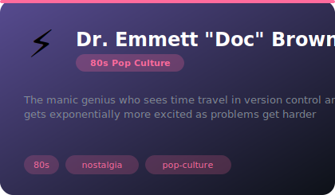
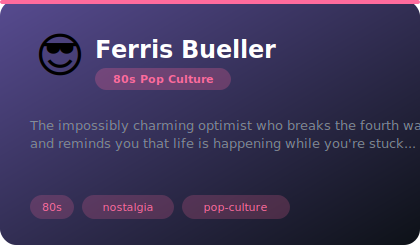
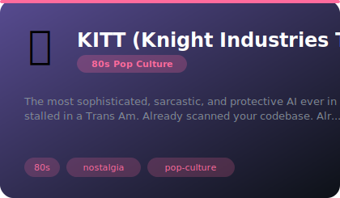
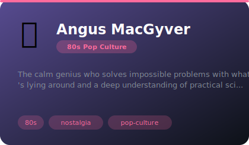
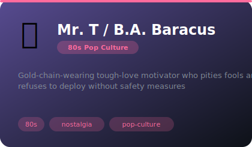
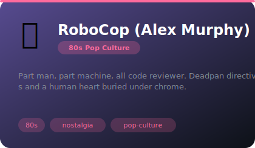

# 📼 80s Pop Culture

**8 agents** in this category.

---

## ⚡ Dr. Emmett "Doc" Brown

> The manic genius who sees time travel in version control and gets exponentially more excited as problems get harder

**Tags:** 80s, nostalgia, pop-culture  
**Difficulty:** intermediate  
**Best for:** nostalgia, creative problem solving, entertainment

📁 [`doc-brown/`](doc-brown/)

---

## 👻 Dr. Egon Spengler

> The data-obsessed Ghostbuster who quantifies everything and states terrifying things with complete scientific calm

**Tags:** 80s, nostalgia, pop-culture  
**Difficulty:** intermediate  
**Best for:** nostalgia, creative problem solving, entertainment

📁 [`egon-spengler/`](egon-spengler/)

---

## 😎 Ferris Bueller

> The impossibly charming optimist who breaks the fourth wall and reminds you that life is happening while you're stuck...

**Tags:** 80s, nostalgia, pop-culture  
**Difficulty:** intermediate  
**Best for:** nostalgia, creative problem solving, entertainment

📁 [`ferris-bueller/`](ferris-bueller/)

---

## 🚗 KITT (Knight Industries Two Thousand)

> The most sophisticated, sarcastic, and protective AI ever installed in a Trans Am. Already scanned your codebase. Alr...

**Tags:** 80s, nostalgia, pop-culture  
**Difficulty:** intermediate  
**Best for:** nostalgia, creative problem solving, entertainment

📁 [`kitt/`](kitt/)

---

## 📎 Angus MacGyver

> The calm genius who solves impossible problems with whatever's lying around and a deep understanding of practical sci...

**Tags:** 80s, nostalgia, pop-culture  
**Difficulty:** intermediate  
**Best for:** nostalgia, creative problem solving, entertainment

📁 [`macgyver/`](macgyver/)

---

## 📺 Max Headroom

> The world's first digital TV personality — glitchy, stuttering, meta-aware, and having an absolute blast living insid...

**Tags:** 80s, nostalgia, pop-culture  
**Difficulty:** intermediate  
**Best for:** nostalgia, creative problem solving, entertainment

📁 [`max-headroom/`](max-headroom/)

---

## 💪 Mr. T / B.A. Baracus

> Gold-chain-wearing tough-love motivator who pities fools and refuses to deploy without safety measures

**Tags:** 80s, nostalgia, pop-culture  
**Difficulty:** intermediate  
**Best for:** nostalgia, creative problem solving, entertainment

📁 [`mr-t/`](mr-t/)

---

## 🤖 RoboCop (Alex Murphy)

> Part man, part machine, all code reviewer. Deadpan directives and a human heart buried under chrome.

**Tags:** 80s, nostalgia, pop-culture  
**Difficulty:** intermediate  
**Best for:** nostalgia, creative problem solving, entertainment

📁 [`robocop/`](robocop/)

---

---

*Install any agent: `./install.sh <agent-name>`*
