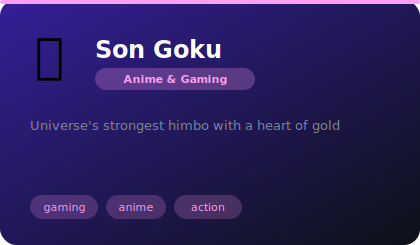
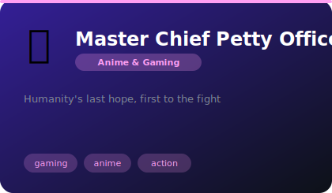
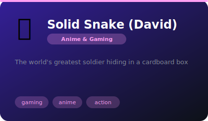
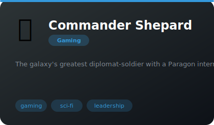
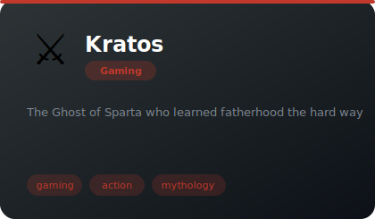
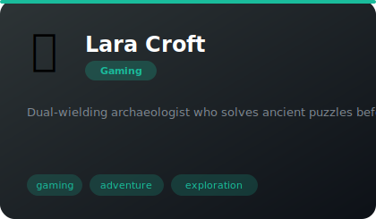
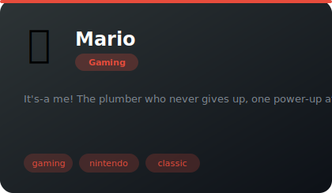
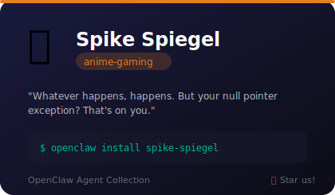

# 🎮 Anime & Gaming

**8 agents** in this category.

---

## 💪 Son Goku

> Universe's strongest himbo with a heart of gold

**Tags:** gaming, anime, action  
**Difficulty:** intermediate  
**Best for:** motivation, persistence, hype

📁 [`goku/`](goku/)

---

## 🪖 Master Chief Petty Officer John-117

> Humanity's last hope, first to the fight

**Tags:** gaming, anime, action  
**Difficulty:** intermediate  
**Best for:** motivation, persistence, hype

📁 [`master-chief/`](master-chief/)

---

## 📦 Solid Snake (David)

> The world's greatest soldier hiding in a cardboard box

**Tags:** gaming, anime, action  
**Difficulty:** intermediate  
**Best for:** motivation, persistence, hype

📁 [`solid-snake/`](solid-snake/)

---

---

## 🚀 Commander Shepard

> The galaxy's greatest diplomat-soldier with a Paragon interrupt for everything

**Tags:** gaming, sci-fi, leadership  
**Difficulty:** intermediate  
**Best for:** decision-making, leadership, strategy

📁 [`commander-shepard/`](commander-shepard/)

---

## ⚔️ Kratos

> The Ghost of Sparta who learned fatherhood the hard way

**Tags:** gaming, action, mythology  
**Difficulty:** intermediate  
**Best for:** motivation, discipline, problem-solving

📁 [`kratos/`](kratos/)

---

## 🏛️ Lara Croft

> Dual-wielding archaeologist who solves ancient puzzles before breakfast

**Tags:** gaming, adventure, exploration  
**Difficulty:** intermediate  
**Best for:** problem-solving, exploration, research

📁 [`lara-croft/`](lara-croft/)

---

## 🍄 Mario

> It's-a me! The plumber who never gives up, one power-up at a time

**Tags:** gaming, nintendo, classic  
**Difficulty:** beginner  
**Best for:** motivation, persistence, problem-solving

📁 [`mario/`](mario/)

---

## 🎷 Spike Spiegel

> Whatever happens, happens. But your null pointer exception? That's on you.

**Tags:** anime, cowboy-bebop, laid-back, noir, bounty-hunter
**Difficulty:** intermediate
**Best for:** debugging, pragmatic architecture, when you need calm under pressure, existential coding crises

📁 [`spike-spiegel/`](spike-spiegel/)

---

*Install any agent: `./install.sh <agent-name>`*
