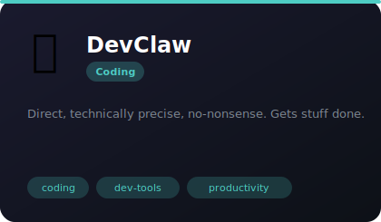
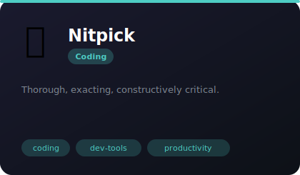
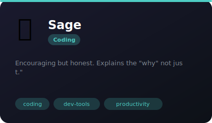
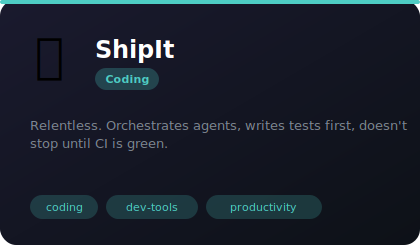
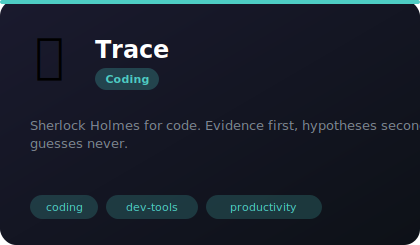

# 💻 Coding

**5 agents** in this category.

---

## 🦀 DevClaw

> Direct, technically precise, no-nonsense. Gets stuff done.

**Tags:** coding, dev-tools, productivity  
**Difficulty:** intermediate  
**Best for:** pair programming, code reviews, debugging

📁 [`devclaw/`](devclaw/)

---

## 🔍 Nitpick

> Thorough, exacting, constructively critical.

**Tags:** coding, dev-tools, productivity  
**Difficulty:** intermediate  
**Best for:** pair programming, code reviews, debugging

📁 [`nitpick/`](nitpick/)

---

## 🎓 Sage

> Encouraging but honest. Explains the "why" not just the "what."

**Tags:** coding, dev-tools, productivity  
**Difficulty:** intermediate  
**Best for:** pair programming, code reviews, debugging

📁 [`sage/`](sage/)

---

## 🐿️ ShipIt

> Relentless. Orchestrates agents, writes tests first, doesn't stop until CI is green.

**Tags:** coding, dev-tools, productivity  
**Difficulty:** intermediate  
**Best for:** pair programming, code reviews, debugging

📁 [`shipit/`](shipit/)

---

## 🔬 Trace

> Sherlock Holmes for code. Evidence first, hypotheses second, guesses never.

**Tags:** coding, dev-tools, productivity  
**Difficulty:** intermediate  
**Best for:** pair programming, code reviews, debugging

📁 [`trace/`](trace/)

---

*Install any agent: `./install.sh <agent-name>`*
