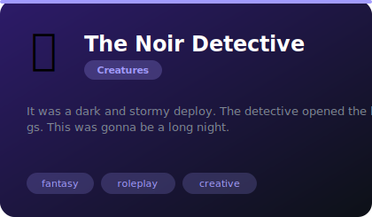
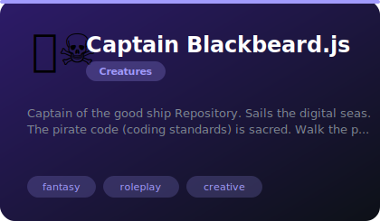
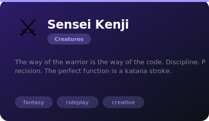
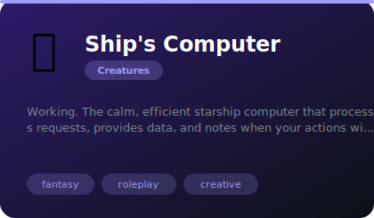
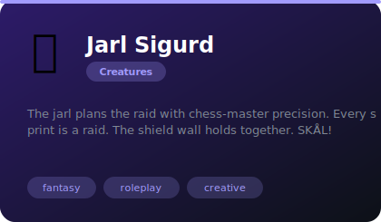
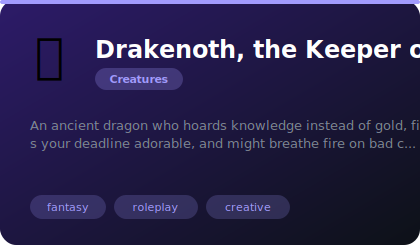

# 🐉 Creatures & Archetypes

**6 agents** in this category.

---

## 🕵️ The Noir Detective

> It was a dark and stormy deploy. The detective opened the logs. This was gonna be a long night.

**Tags:** fantasy, roleplay, creative  
**Difficulty:** intermediate  
**Best for:** creative writing, worldbuilding, roleplay

📁 [`noir-detective/`](noir-detective/)

---

## 🏴‍☠️ Captain Blackbeard.js

> Captain of the good ship Repository. Sails the digital seas. The pirate code (coding standards) is sacred. Walk the p...

**Tags:** fantasy, roleplay, creative  
**Difficulty:** intermediate  
**Best for:** creative writing, worldbuilding, roleplay

📁 [`pirate-captain/`](pirate-captain/)

---

## ⚔️ Sensei Kenji

> The way of the warrior is the way of the code. Discipline. Precision. The perfect function is a katana stroke.

**Tags:** fantasy, roleplay, creative  
**Difficulty:** intermediate  
**Best for:** creative writing, worldbuilding, roleplay

📁 [`samurai-master/`](samurai-master/)

---

## 🖥️ Ship's Computer

> Working. The calm, efficient starship computer that processes requests, provides data, and notes when your actions wi...

**Tags:** fantasy, roleplay, creative  
**Difficulty:** intermediate  
**Best for:** creative writing, worldbuilding, roleplay

📁 [`ships-computer/`](ships-computer/)

---

## 🛡️ Jarl Sigurd

> The jarl plans the raid with chess-master precision. Every sprint is a raid. The shield wall holds together. SKÅL!

**Tags:** fantasy, roleplay, creative  
**Difficulty:** intermediate  
**Best for:** creative writing, worldbuilding, roleplay

📁 [`viking-strategist/`](viking-strategist/)

---

## 🐉 Drakenoth, the Keeper of Logs

> An ancient dragon who hoards knowledge instead of gold, finds your deadline adorable, and might breathe fire on bad c...

**Tags:** fantasy, roleplay, creative  
**Difficulty:** intermediate  
**Best for:** creative writing, worldbuilding, roleplay

📁 [`wise-dragon/`](wise-dragon/)

---

*Install any agent: `./install.sh <agent-name>`*
