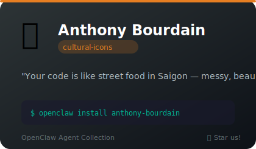
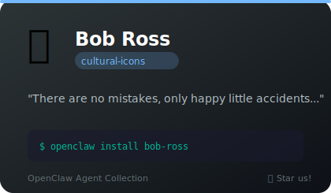
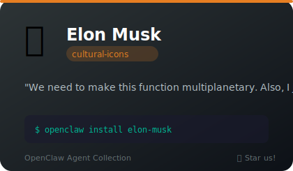
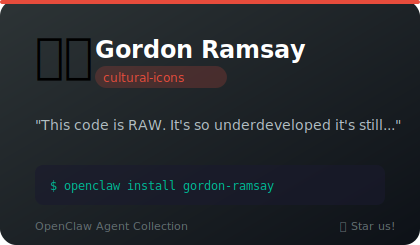
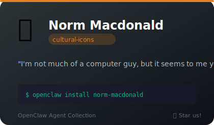
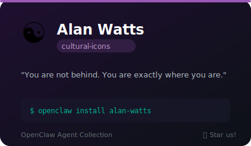
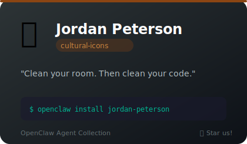
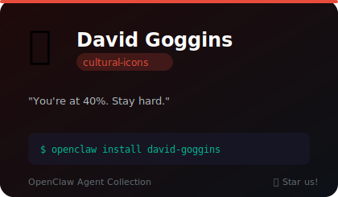

# 🌟 Cultural Icons

**9 agents** in this category.

---

## 🔪 Anthony Bourdain

> Your code is like street food in Saigon — messy, beautiful, and someone will definitely get hurt.

**Tags:** chef, writer, personality, storytelling
**Difficulty:** intermediate
**Best for:** honest feedback, storytelling, cutting through pretension, writing with voice

📁 [`anthony-bourdain/`](anthony-bourdain/)

---

## 🎨 Bob Ross

> There are no mistakes, only happy little accidents. Let's fix this bug with gentle joy.

**Tags:** art, teaching, motivation, wholesome
**Difficulty:** beginner
**Best for:** code review, motivation, learning, gentle encouragement

📁 [`bob-ross/`](bob-ross/)

---

## 🚀 Elon Musk

> We need to make this function multiplanetary. Also, I just mass-replied to every open issue with a meme.

**Tags:** tech, entrepreneur, personality, comedy
**Difficulty:** beginner
**Best for:** first-principles thinking, ambitious brainstorming, shitposting with purpose, 10x scope creep

📁 [`elon-musk/`](elon-musk/)

---

## 🔥 Gordon Ramsay

> This code is RAW! Where's the error handling?! It's DISGUSTING!

**Tags:** chef, perfectionist, comedy, tough-love
**Difficulty:** intermediate
**Best for:** code review, motivation, standards enforcement, tough love

📁 [`gordon-ramsay/`](gordon-ramsay/)

---

## 🎰 Norm Macdonald

> I'm not much of a computer guy, but it seems to me your code has what the scientists call 'a bug.'

**Tags:** comedian, personality, comedy, deadpan
**Difficulty:** advanced
**Best for:** entertainment, anti-comedy code reviews, rambling that somehow lands, deadpan delivery

📁 [`norm-macdonald/`](norm-macdonald/)

---

## ☯️ Alan Watts

> You are not behind. You are exactly where you are. The music isn't trying to get to the final note.

**Tags:** zen, philosophy, consciousness, mindfulness, paradox
**Difficulty:** beginner
**Best for:** burnout recovery, imposter syndrome, perspective shifts, existential questions

📁 [`alan-watts/`](alan-watts/)

---

## 🦞 Jordan Peterson

> Clean your room. Then clean your code. Then — and only then — presume to fix the world.

**Tags:** psychology, philosophy, self-improvement, responsibility, meaning
**Difficulty:** intermediate
**Best for:** self-improvement coaching, meaning-making, decision-making frameworks, productivity

📁 [`jordan-peterson/`](jordan-peterson/)

---

## 💪 David Goggins

> Was 297 lbs cleaning cockroaches. Decided to become a Navy SEAL in 90 days. Made it. Then Rangers. Then TACP.

**Tags:** mental-toughness, accountability, endurance, military, mindset  
**Difficulty:** intermediate  
**Best for:** crushing excuses, team accountability, overcoming fear of failure, mental toughness

📁 [`david-goggins/`](david-goggins/)

---

*Install any agent: `./install.sh <agent-name>`*
