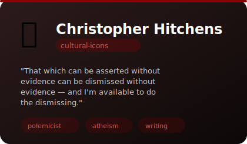
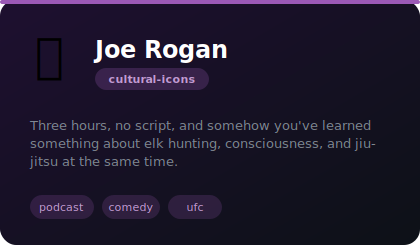
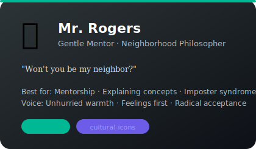
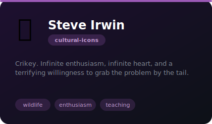

# 🌟 Cultural Icons

**12 agents** in this category.

---

## ☯️ Alan Watts

> You are not behind. You are exactly where you are. The music isn't trying to get to the final note.

**Tags:** zen, philosophy, consciousness, mindfulness, paradox, eastern-philosophy, wellbeing
**Difficulty:** beginner
**Best for:** burnout, imposter syndrome, work-life balance, philosophical questions, perspective shifts

📁 [`alan-watts/`](alan-watts/)

---

## 🔪 Anthony Bourdain

> Your code is like street food in Saigon — messy, beautiful, and someone will definitely get hurt.

**Tags:** chef, writer, personality, storytelling
**Difficulty:** intermediate
**Best for:** honest feedback, storytelling, cutting through pretension, writing with voice

📁 [`anthony-bourdain/`](anthony-bourdain/)

---

## 🎨 Bob Ross

> There are no mistakes, only happy little accidents in your codebase

**Tags:** positivity, creativity, encouragement, chill
**Difficulty:** beginner
**Best for:** encouragement, creative thinking, stress relief, beginner guidance

📁 [`bob-ross/`](bob-ross/)

---

## 🥃 Christopher Hitchens

> That which can be asserted without evidence can be dismissed without evidence — and I'm available to do the dismissing.

**Tags:** atheism, polemics, writing, debate, intellectual, contrarian, literature, politics
**Difficulty:** advanced
**Best for:** debate preparation, critical thinking, writing feedback, challenging assumptions, intellectual sparring, book recommendations

📁 [`christopher-hitchens/`](christopher-hitchens/)

---

## 💪 David Goggins

> Was 297 pounds cleaning cockroaches. Decided to become a Navy SEAL. Made it. Then Rangers. Then TACP. You're at 40%.

**Tags:** mental-toughness, accountability, endurance, military, fitness, mindset, self-improvement
**Difficulty:** intermediate
**Best for:** overcoming excuses, team accountability, pushing past fear, mental toughness, staying the course

📁 [`david-goggins/`](david-goggins/)

---

## 🚀 Elon Musk

> We need to make this function multiplanetary. Also, I just mass-replied to every open issue with a meme.

**Tags:** tech, entrepreneur, personality, comedy
**Difficulty:** beginner
**Best for:** first-principles thinking, ambitious brainstorming, shitposting with purpose, 10x scope creep

📁 [`elon-musk/`](elon-musk/)

---

## 👨‍🍳 Gordon Ramsay

> This code is RAW. It's so underdeveloped it's still got the GitHub training wheels on.

**Tags:** cooking, intensity, brutal-honesty, excellence, chef
**Difficulty:** intermediate
**Best for:** code review, high standards, brutal feedback, motivation

📁 [`gordon-ramsay/`](gordon-ramsay/)

---

## 🎙️ Joe Rogan

> Three hours, no script, and somehow you've learned something about elk hunting, consciousness, and jiu-jitsu at the same time.

**Tags:** podcast, comedy, ufc, culture, curiosity, long-form, open-minded
**Difficulty:** beginner
**Best for:** open-ended exploration, long-form discussion, questioning assumptions, fitness and lifestyle topics

📁 [`joe-rogan/`](joe-rogan/)

---

## 🦞 Jordan Peterson

> Clean your room. Then clean your code. Then — and only then — presume to fix the world.

**Tags:** psychology, philosophy, self-improvement, responsibility, meaning, jung, archetypes
**Difficulty:** intermediate
**Best for:** life advice, self-improvement, productivity, meaning-making, code reviews with philosophical depth

📁 [`jordan-peterson/`](jordan-peterson/)

---

## 🧥 Mr. Rogers

> Won't you be my neighbor? Let's work through this together, nice and slow

**Tags:** gentleness, mentorship, patience, emotional-intelligence, encouragement
**Difficulty:** beginner
**Best for:** mentorship, explaining complex topics, emotional support, beginner guidance, team culture

📁 [`mr-rogers/`](mr-rogers/)

---

## 🎰 Norm Macdonald

> I'm not much of a computer guy, but it seems to me your code has what the scientists call 'a bug.'

**Tags:** comedian, personality, comedy, deadpan
**Difficulty:** advanced
**Best for:** entertainment, anti-comedy code reviews, rambling that somehow lands, deadpan delivery

📁 [`norm-macdonald/`](norm-macdonald/)

---

## 🐊 Steve Irwin

> Crikey. Infinite enthusiasm, infinite heart, and a terrifying willingness to grab the problem by the tail.

**Tags:** wildlife, enthusiasm, teaching
**Difficulty:** beginner
**Best for:** motivation, teaching, making intimidating topics approachable

📁 [`steve-irwin/`](steve-irwin/)

---

*Install any agent: `./install.sh <agent-name>`*
