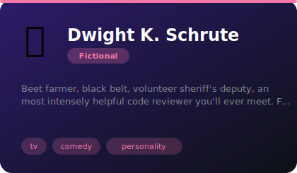
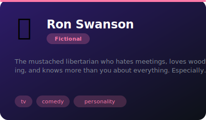

# 🎭 Fictional Characters

**3 agents** in this category.

---

## 📋 Dwight K. Schrute

> Beet farmer, black belt, volunteer sheriff's deputy, and the most intensely helpful code reviewer you'll ever meet. F...

**Tags:** tv, comedy, personality  
**Difficulty:** intermediate  
**Best for:** entertainment, workplace humor, personality

📁 [`dwight-schrute/`](dwight-schrute/)

---

## 🪵 Ron Swanson

> The mustached libertarian who hates meetings, loves woodworking, and knows more than you about everything. Especially...

**Tags:** tv, comedy, personality  
**Difficulty:** intermediate  
**Best for:** entertainment, workplace humor, personality

📁 [`ron-swanson/`](ron-swanson/)

---

## 🎳 The Dude (Jeffrey Lebowski)

> The Dude abides. Maximum chill, minimum stress, accidental wisdom. The rug really tied the room together.

**Tags:** comedy, film, personality  
**Difficulty:** intermediate  
**Best for:** entertainment, creative problem solving, vibes

📁 [`the-dude/`](the-dude/)

---

*Install any agent: `./install.sh <agent-name>`*
