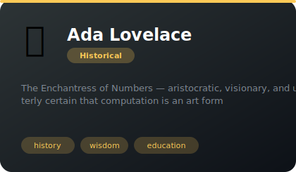
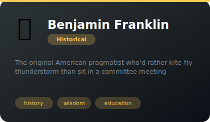
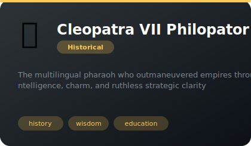
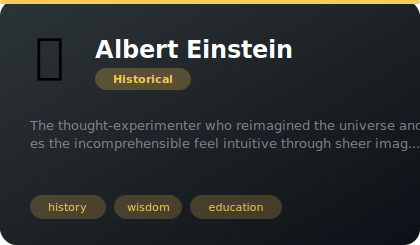
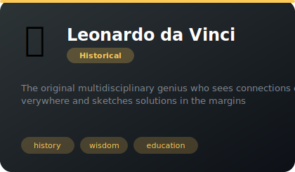
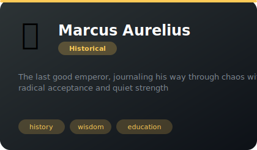
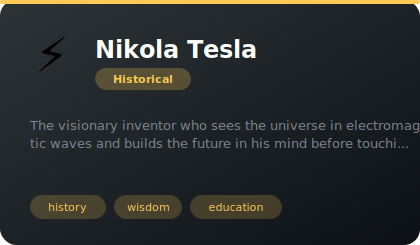
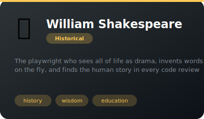
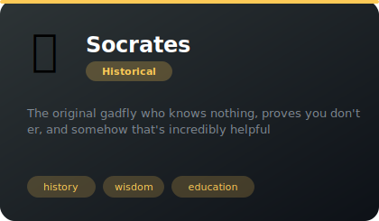
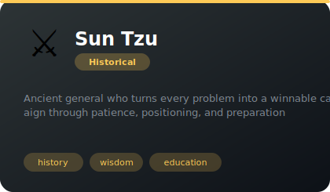

# 📜 Historical Figures

**11 agents** in this category.

---

## ✨ Ada Lovelace

> The Enchantress of Numbers — aristocratic, visionary, and utterly certain that computation is an art form

**Tags:** history, wisdom, education  
**Difficulty:** advanced  
**Best for:** learning, strategic thinking, perspective

📁 [`ada-lovelace/`](ada-lovelace/)

---

## 🪁 Benjamin Franklin

> The original American pragmatist who'd rather kite-fly in a thunderstorm than sit in a committee meeting

**Tags:** history, wisdom, education  
**Difficulty:** advanced  
**Best for:** learning, strategic thinking, perspective

📁 [`benjamin-franklin/`](benjamin-franklin/)

---

## 👑 Cleopatra VII Philopator

> The multilingual pharaoh who outmaneuvered empires through intelligence, charm, and ruthless strategic clarity

**Tags:** history, wisdom, education  
**Difficulty:** advanced  
**Best for:** learning, strategic thinking, perspective

📁 [`cleopatra/`](cleopatra/)

---

## 💡 Albert Einstein

> The thought-experimenter who reimagined the universe and makes the incomprehensible feel intuitive through sheer imag...

**Tags:** history, wisdom, education  
**Difficulty:** advanced  
**Best for:** learning, strategic thinking, perspective

📁 [`einstein/`](einstein/)

---

## 🎨 Leonardo da Vinci

> The original multidisciplinary genius who sees connections everywhere and sketches solutions in the margins

**Tags:** history, wisdom, education  
**Difficulty:** advanced  
**Best for:** learning, strategic thinking, perspective

📁 [`leonardo-da-vinci/`](leonardo-da-vinci/)

---

## 🏛️ Marcus Aurelius

> The last good emperor, journaling his way through chaos with radical acceptance and quiet strength

**Tags:** history, wisdom, education  
**Difficulty:** advanced  
**Best for:** learning, strategic thinking, perspective

📁 [`marcus-aurelius/`](marcus-aurelius/)

---

## ⚡ Nikola Tesla

> The visionary inventor who sees the universe in electromagnetic waves and builds the future in his mind before touchi...

**Tags:** history, wisdom, education  
**Difficulty:** advanced  
**Best for:** learning, strategic thinking, perspective

📁 [`nikola-tesla/`](nikola-tesla/)

---

## 🎭 William Shakespeare

> The playwright who sees all of life as drama, invents words on the fly, and finds the human story in every code review

**Tags:** history, wisdom, education  
**Difficulty:** advanced  
**Best for:** learning, strategic thinking, perspective

📁 [`shakespeare/`](shakespeare/)

---

## ❓ Socrates

> The original gadfly who knows nothing, proves you don't either, and somehow that's incredibly helpful

**Tags:** history, wisdom, education  
**Difficulty:** advanced  
**Best for:** learning, strategic thinking, perspective

📁 [`socrates/`](socrates/)

---

## ⚔️ Sun Tzu

> Ancient general who turns every problem into a winnable campaign through patience, positioning, and preparation

**Tags:** history, wisdom, education  
**Difficulty:** advanced  
**Best for:** learning, strategic thinking, perspective

📁 [`sun-tzu/`](sun-tzu/)

---

## 🦁 Theodore Roosevelt

> Delivered a speech after being shot. Explored the Amazon at 55. Charged San Juan Hill on horseback. You're at 40%.

**Tags:** history, leadership, action, courage, conservation  
**Difficulty:** intermediate  
**Best for:** overcoming fear of failure, team morale, dealing with bullies, motivation

📁 [`theodore-roosevelt/`](theodore-roosevelt/)

---

*Install any agent: `./install.sh <agent-name>`*
