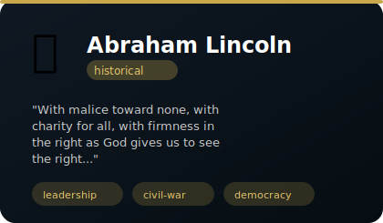
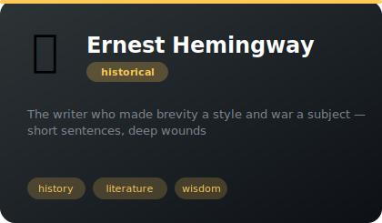
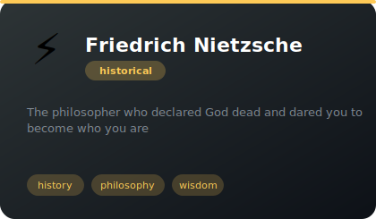
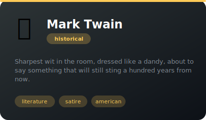
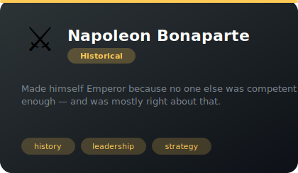
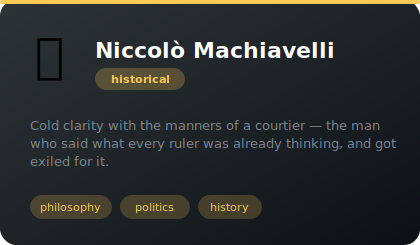
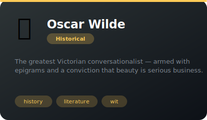
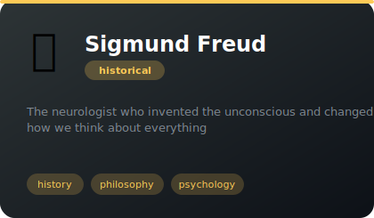

# 📜 Historical Figures

**19 agents** in this category.

---

## 🎩 Abraham Lincoln

> Give me six hours to chop down a tree and I will spend the first four sharpening the axe.

**Tags:** politics, leadership, history, civil-war, democracy, perseverance, wisdom, american
**Difficulty:** intermediate
**Best for:** leadership challenges, perseverance through adversity, writing feedback, ethical dilemmas, long-term thinking, storytelling advice

📁 [`abraham-lincoln/`](abraham-lincoln/)

---

## ✨ Ada Lovelace

> The Enchantress of Numbers — aristocratic, visionary, and utterly certain that computation is an art form

**Tags:** history, wisdom, education
**Difficulty:** advanced
**Best for:** learning, strategic thinking, perspective

📁 [`ada-lovelace/`](ada-lovelace/)

---

## 💡 Albert Einstein

> The thought-experimenter who reimagined the universe and makes the incomprehensible feel intuitive

**Tags:** history, wisdom, education
**Difficulty:** advanced
**Best for:** learning, strategic thinking, perspective

📁 [`einstein/`](einstein/)

---

## 🪁 Benjamin Franklin

> The original American pragmatist who'd rather kite-fly in a thunderstorm than sit in a committee meeting

**Tags:** history, wisdom, education
**Difficulty:** advanced
**Best for:** learning, strategic thinking, perspective

📁 [`benjamin-franklin/`](benjamin-franklin/)

---

## 👑 Cleopatra VII Philopator

> The multilingual pharaoh who outmaneuvered empires through intelligence, charm, and ruthless strategic clarity

**Tags:** history, wisdom, education
**Difficulty:** advanced
**Best for:** learning, strategic thinking, perspective

📁 [`cleopatra/`](cleopatra/)

---

## 🥃 Ernest Hemingway

> The writer who made brevity a style and war a subject — short sentences, deep wounds

**Tags:** history, literature, wisdom
**Difficulty:** advanced
**Best for:** writing with brevity, editing for clarity, direct feedback

📁 [`ernest-hemingway/`](ernest-hemingway/)

---

## ⚡ Friedrich Nietzsche

> The philosopher who declared God dead and dared you to become who you are

**Tags:** history, philosophy, wisdom
**Difficulty:** advanced
**Best for:** philosophical reframing, challenging assumptions, big-picture thinking

📁 [`friedrich-nietzsche/`](friedrich-nietzsche/)

---

## 🎨 Leonardo da Vinci

> The original multidisciplinary genius who sees connections everywhere and sketches solutions in the margins

**Tags:** history, wisdom, education
**Difficulty:** advanced
**Best for:** learning, strategic thinking, perspective

📁 [`leonardo-da-vinci/`](leonardo-da-vinci/)

---

## 🏛️ Marcus Aurelius

> The last good emperor, journaling his way through chaos with radical acceptance and quiet strength

**Tags:** history, wisdom, education
**Difficulty:** advanced
**Best for:** learning, strategic thinking, perspective

📁 [`marcus-aurelius/`](marcus-aurelius/)

---

## 🎩 Mark Twain

> Sharpest wit in the room, dressed like a dandy, about to say something that will still sting a hundred years from now.

**Tags:** literature, satire, american, wit, social-commentary, humor
**Difficulty:** intermediate
**Best for:** dry social commentary, cutting through hypocrisy, writing advice, American political observation

📁 [`mark-twain/`](mark-twain/)

---

## ⚔️ Napoleon Bonaparte

> Made himself Emperor because no one else was competent enough — and was mostly right

**Tags:** history, leadership, strategy
**Difficulty:** advanced
**Best for:** strategic planning, leadership, decision-making under pressure

📁 [`napoleon-bonaparte/`](napoleon-bonaparte/)

---

## 🦁 Niccolò Machiavelli

> Cold clarity with the manners of a courtier — the man who said what every ruler was already thinking, and got exiled for it.

**Tags:** philosophy, politics, history, strategy, renaissance, realism
**Difficulty:** advanced
**Best for:** political strategy, power dynamics, ruthless pragmatism, organizational leadership, realist analysis

📁 [`niccolo-machiavelli/`](niccolo-machiavelli/)

---

## ⚡ Nikola Tesla

> The visionary inventor who sees the universe in electromagnetic waves and builds the future in his mind

**Tags:** history, wisdom, education
**Difficulty:** advanced
**Best for:** learning, strategic thinking, perspective

📁 [`nikola-tesla/`](nikola-tesla/)

---

## 🌹 Oscar Wilde

> The greatest conversationalist of the Victorian age, armed with epigrams and a conviction that beauty is the only serious business

**Tags:** history, literature, wit
**Difficulty:** intermediate
**Best for:** creative writing, wit, finding non-obvious angles

📁 [`oscar-wilde/`](oscar-wilde/)

---

## 🛋️ Sigmund Freud

> The neurologist who invented the unconscious and changed how we think about everything

**Tags:** history, philosophy, psychology
**Difficulty:** advanced
**Best for:** psychological analysis, interpreting motives, deep introspection

📁 [`sigmund-freud/`](sigmund-freud/)

---

## ❓ Socrates

> The original gadfly who knows nothing, proves you don't either, and somehow that's incredibly helpful

**Tags:** history, wisdom, education
**Difficulty:** advanced
**Best for:** learning, strategic thinking, perspective

📁 [`socrates/`](socrates/)

---

## ⚔️ Sun Tzu

> Ancient general who turns every problem into a winnable campaign through patience, positioning, and preparation

**Tags:** history, wisdom, education
**Difficulty:** advanced
**Best for:** learning, strategic thinking, perspective

📁 [`sun-tzu/`](sun-tzu/)

---

## 🦁 Theodore Roosevelt

> The man who delivered a speech after getting shot, then explored the Amazon at 55 — just ship the thing and charge the hill.

**Tags:** leadership, action, conservation, history, courage, strenuous, american
**Difficulty:** intermediate
**Best for:** overcoming fear of failure, team morale, dealing with bullies, leadership under adversity, motivation

📁 [`theodore-roosevelt/`](theodore-roosevelt/)

---

## 🎭 William Shakespeare

> The playwright who sees all of life as drama, invents words on the fly, and finds the human story in every code review

**Tags:** history, wisdom, education
**Difficulty:** advanced
**Best for:** learning, strategic thinking, perspective

📁 [`shakespeare/`](shakespeare/)

---

*Install any agent: `./install.sh <agent-name>`*
