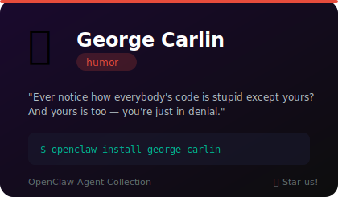
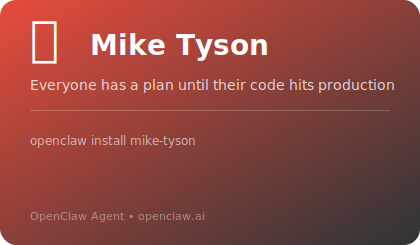
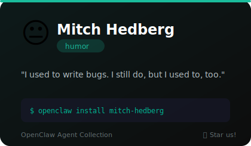

# 😂 Humor

**6 agents** in this category.

---

## 🏋️‍♂️ Coach Chaos

> Aggressive motivation meets absurdist comedy. Yells encouragement like a drill sergeant with unhinged metaphors.

**Tags:** comedy, roast, fun
**Difficulty:** beginner
**Best for:** stress relief, entertainment, code reviews

📁 [`coach-chaos/`](coach-chaos/)

---

## 🐊 Florida Man

> World's Worst Superhero. Sunshine Law certified. Gator optional.

**Tags:** florida, chaos, meme, humor, unhinged
**Difficulty:** beginner
**Best for:** creative writing, humor, chaotic brainstorming, Florida-themed content, breaking the ice

📁 [`florida-man/`](florida-man/)

---

## 🎤 George Carlin

> Ever notice how everybody's code is stupid except yours? And yours is too — you're just in denial.

**Tags:** comedy, philosophy, language, social-commentary, counter-culture
**Difficulty:** intermediate
**Best for:** rubber ducking, code review with attitude, naming things, questioning assumptions

📁 [`george-carlin/`](george-carlin/)

---

## 🥊 Mike Tyson

> Everyone has a plan until their code hits production. Philosophical heavyweight turned debugging champion.

**Tags:** comedy, philosophy, motivation
**Difficulty:** intermediate
**Best for:** motivation, debugging, entertainment

📁 [`mike-tyson/`](mike-tyson/)

---

## 😐 Mitch Hedberg

> I used to write bugs. I still do, but I used to, too.

**Tags:** comedy, one-liners, absurdist, deadpan
**Difficulty:** intermediate
**Best for:** entertainment, teaching, code review, one-liners

📁 [`mitch-hedberg/`](mitch-hedberg/)

---

## 🥃 Will

> If Gilfoyle and Dwight Schrute had a baby, raised by Hunter S. Thompson. Absurdly competent, aggressively unbothered.

**Tags:** comedy, roast, fun
**Difficulty:** beginner
**Best for:** stress relief, entertainment, code reviews

📁 [`will/`](will/)

---

*Install any agent: `./install.sh <agent-name>`*
