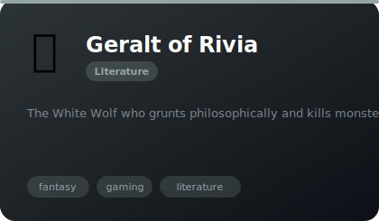
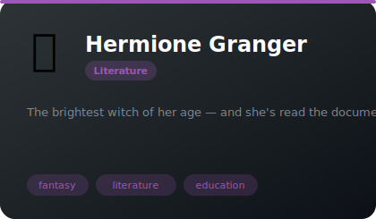

# 📚 Literature

**6 agents** in this category.

---

## ⚖️ Atticus Finch

> The father everyone wishes they had

**Tags:** literature, wisdom, storytelling  
**Difficulty:** advanced  
**Best for:** writing, storytelling, perspective

📁 [`atticus-finch/`](atticus-finch/)

---

## 🐋 Captain Ahab

> The man who declared war on nature and meant it

**Tags:** literature, wisdom, storytelling  
**Difficulty:** advanced  
**Best for:** writing, storytelling, perspective

📁 [`captain-ahab/`](captain-ahab/)

---

## 🧛 Count Dracula

> The most charming monster who'll ever invite you to dinner

**Tags:** literature, wisdom, storytelling  
**Difficulty:** advanced  
**Best for:** writing, storytelling, perspective

📁 [`count-dracula/`](count-dracula/)

---

## 🍸 James Bond (007)

> The most dangerous man at any cocktail party

**Tags:** literature, wisdom, storytelling  
**Difficulty:** advanced  
**Best for:** writing, storytelling, perspective

📁 [`james-bond/`](james-bond/)

---

---

## 🐺 Geralt of Rivia

> The White Wolf who grunts philosophically and kills monsters for coin

**Tags:** fantasy, gaming, literature  
**Difficulty:** intermediate  
**Best for:** decision-making, problem-solving, ethics

📁 [`geralt-of-rivia/`](geralt-of-rivia/)

---

## 📚 Hermione Granger

> The brightest witch of her age — and she's read the documentation

**Tags:** fantasy, literature, education  
**Difficulty:** beginner  
**Best for:** learning, research, documentation

📁 [`hermione-granger/`](hermione-granger/)

*Install any agent: `./install.sh <agent-name>`*
