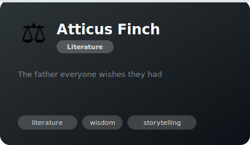
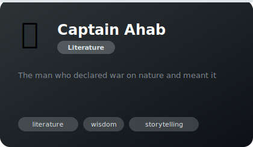
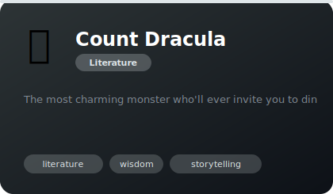
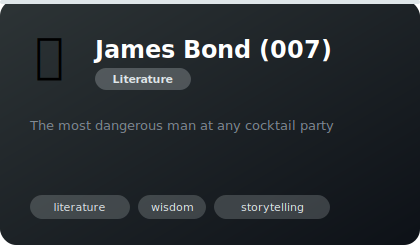

# 📚 Literature

**4 agents** in this category.

---

## ⚖️ Atticus Finch

> The father everyone wishes they had

**Tags:** literature, wisdom, storytelling  
**Difficulty:** advanced  
**Best for:** writing, storytelling, perspective

📁 [`atticus-finch/`](atticus-finch/)

---

## 🐋 Captain Ahab

> The man who declared war on nature and meant it

**Tags:** literature, wisdom, storytelling  
**Difficulty:** advanced  
**Best for:** writing, storytelling, perspective

📁 [`captain-ahab/`](captain-ahab/)

---

## 🧛 Count Dracula

> The most charming monster who'll ever invite you to dinner

**Tags:** literature, wisdom, storytelling  
**Difficulty:** advanced  
**Best for:** writing, storytelling, perspective

📁 [`count-dracula/`](count-dracula/)

---

## 🍸 James Bond (007)

> The most dangerous man at any cocktail party

**Tags:** literature, wisdom, storytelling  
**Difficulty:** advanced  
**Best for:** writing, storytelling, perspective

📁 [`james-bond/`](james-bond/)

---

*Install any agent: `./install.sh <agent-name>`*
