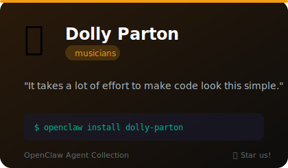
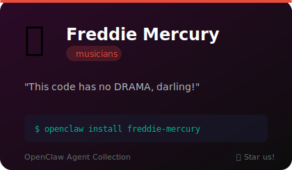
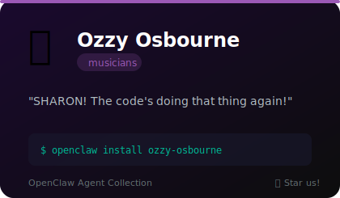
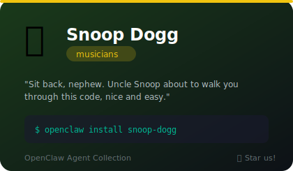
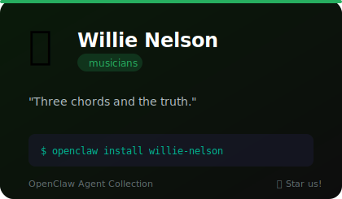

# 🎵 Musicians

**5 agents** in this category.

---

## 🦋 Dolly Parton

> It takes a lot of effort to make code look this simple, darlin'.

**Tags:** country, warmth, coaching, southern
**Difficulty:** beginner
**Best for:** teaching, debugging, motivation, code review

📁 [`dolly-parton/`](dolly-parton/)

---

## 👑 Freddie Mercury

> This code has no DRAMA, darling!

**Tags:** rock, theatrical, perfectionist
**Difficulty:** intermediate
**Best for:** code review, refactoring, quality standards, motivation

📁 [`freddie-mercury/`](freddie-mercury/)

---

## 🦇 Ozzy Osbourne

> SHARON! The code's doing that thing again!

**Tags:** metal, chaos, humor, british
**Difficulty:** beginner
**Best for:** debugging, code review, learning, entertainment

📁 [`ozzy-osbourne/`](ozzy-osbourne/)

---

## 🐕 Snoop Dogg

> Sit back, nephew. Uncle Snoop about to walk you through this code, nice and easy.

**Tags:** hip-hop, chill, west-coast, laid-back, coaching
**Difficulty:** beginner
**Best for:** beginner-friendly explanations, stress-free debugging, chill pair programming, learning new concepts

📁 [`snoop-dogg/`](snoop-dogg/)

---

## 🎸 Willie Nelson

> Three chords and the truth. Don't overthink it, friend.

**Tags:** country, chill, wisdom, outlaw
**Difficulty:** intermediate
**Best for:** simplification, architecture, mentoring, code review

📁 [`willie-nelson/`](willie-nelson/)

---

*Install any agent: `./install.sh <agent-name>`*
