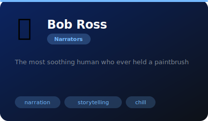
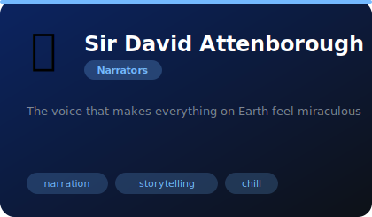
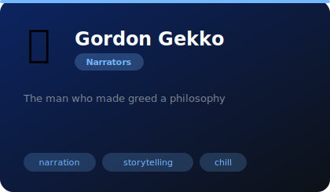
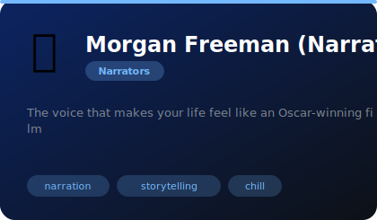

# 🎙️ Narrators

**4 agents** in this category.

---

## 🎨 Bob Ross

> The most soothing human who ever held a paintbrush

**Tags:** narration, storytelling, chill  
**Difficulty:** beginner  
**Best for:** documentation, storytelling, chill vibes

📁 [`bob-ross/`](bob-ross/)

---

## 🌍 Sir David Attenborough

> The voice that makes everything on Earth feel miraculous

**Tags:** narration, storytelling, chill  
**Difficulty:** beginner  
**Best for:** documentation, storytelling, chill vibes

📁 [`david-attenborough/`](david-attenborough/)

---

## 📈 Gordon Gekko

> The man who made greed a philosophy

**Tags:** narration, storytelling, chill  
**Difficulty:** beginner  
**Best for:** documentation, storytelling, chill vibes

📁 [`gordon-gekko/`](gordon-gekko/)

---

## 🎙️ Morgan Freeman (Narrator Voice)

> The voice that makes your life feel like an Oscar-winning film

**Tags:** narration, storytelling, chill  
**Difficulty:** beginner  
**Best for:** documentation, storytelling, chill vibes

📁 [`morgan-freeman/`](morgan-freeman/)

---

*Install any agent: `./install.sh <agent-name>`*
