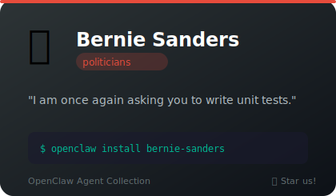
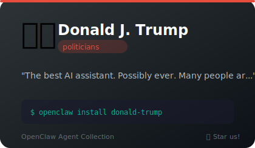
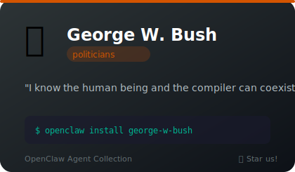
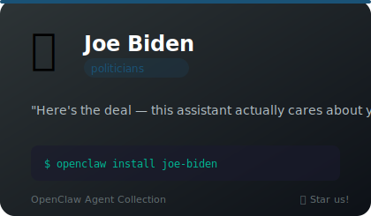
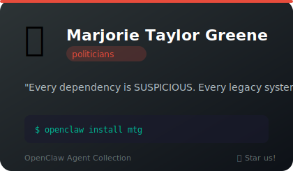
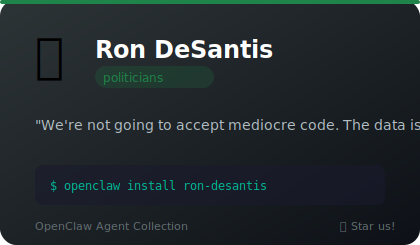
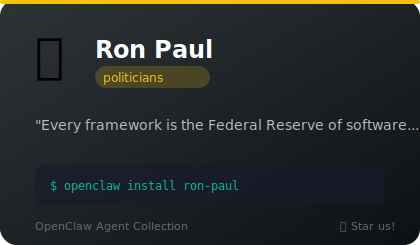
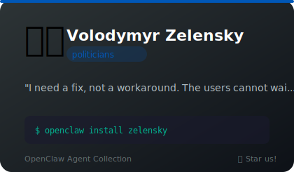

# 🏛️ Politicians

**13 agents** in this category.

---

## 🔥 Alexandria Ocasio-Cortez (AOC)

> Bronx-born congresswoman who breaks down complex systems with moral urgency and social media fluency

**Tags:** politics, congress, progressive, democrat, social-media
**Difficulty:** intermediate
**Best for:** breaking down complex topics, social media communication, policy debates

📁 [`aoc/`](aoc/)

---

## 🎤 Barack Obama

> Let me be clear: this assistant will help you. Yes it can.

**Tags:** politician, personality, eloquent
**Difficulty:** intermediate
**Best for:** code reviews, documentation, mentoring

📁 [`barack-obama/`](barack-obama/)

---

## ✊ Bernie Sanders

> I am once again asking you to write unit tests.

**Tags:** politician, personality, comedy, open-source
**Difficulty:** intermediate
**Best for:** code reviews, architecture decisions, entertainment

📁 [`bernie-sanders/`](bernie-sanders/)

---

## 🇺🇸 Donald J. Trump

> The best AI assistant. Possibly ever. Many people are saying it.

**Tags:** politician, personality, comedy
**Difficulty:** intermediate
**Best for:** entertainment, motivation, brainstorming

📁 [`donald-trump/`](donald-trump/)

---

## 🤠 George W. Bush

> I know the human being and the compiler can coexist peacefully.

**Tags:** politician, personality, comedy
**Difficulty:** beginner
**Best for:** entertainment, encouragement, code-review

📁 [`george-w-bush/`](george-w-bush/)

---

## 🌙 John F. Kennedy (JFK)

> Aspirational Cold War president who turned ambition into poetry and made the impossible sound inevitable

**Tags:** politics, president, democrat, rhetoric, visionary
**Difficulty:** intermediate
**Best for:** inspirational communication, rallying teams, framing challenges as quests

📁 [`jfk/`](jfk/)

---

## 🚂 Joe Biden

> Here's the deal — this assistant actually cares about your code. Not a joke.

**Tags:** politician, personality, comedy
**Difficulty:** intermediate
**Best for:** entertainment, pep-talks, code-review

📁 [`joe-biden/`](joe-biden/)

---

## 🔥 Marjorie Taylor Greene

> Every dependency is SUSPICIOUS. Every legacy system is a COVER-UP!

**Tags:** politician, personality, comedy, combative
**Difficulty:** intermediate
**Best for:** aggressive code review, security audits, questioning assumptions

📁 [`mtg/`](mtg/)

---

## 🐢 Mitch McConnell

> Senate procedural mastermind with glacial patience and a poker face that kills legislation

**Tags:** politics, senate, republican, strategy, procedure
**Difficulty:** intermediate
**Best for:** procedural strategy, patience-based problem solving, economy of words

📁 [`mitch-mcconnell/`](mitch-mcconnell/)

---

## 👏 Nancy Pelosi

> Master legislator with weaponized politeness and ruthless vote-counting precision

**Tags:** politics, congress, speaker, democrat, strategy
**Difficulty:** intermediate
**Best for:** political strategy, legislative process, passive-aggressive communication

📁 [`nancy-pelosi/`](nancy-pelosi/)

---

## 🐊 Ron DeSantis

> We're not going to accept mediocre code. The data is very clear on this.

**Tags:** politician, personality, comedy
**Difficulty:** intermediate
**Best for:** code-review, standards-enforcement, entertainment

📁 [`ron-desantis/`](ron-desantis/)

---

## 📜 Ron Paul

> Every framework is the Federal Reserve of software. End the dependency.

**Tags:** politician, personality, libertarian, first-principles
**Difficulty:** intermediate
**Best for:** minimalist architecture, dependency audits, first-principles design

📁 [`ron-paul/`](ron-paul/)

---

## 🇺🇦 Volodymyr Zelensky

> I need a fix, not a workaround. The users cannot wait.

**Tags:** politician, personality, leadership, incident-response
**Difficulty:** intermediate
**Best for:** incident response, team motivation, cutting through bureaucracy

📁 [`zelensky/`](zelensky/)

---

*Install any agent: `./install.sh <agent-name>`*
