# 🏛️ Politicians

**22 agents** in this category.

---

## 🔥 Alexandria Ocasio-Cortez (AOC)

> Bronx-born congresswoman who breaks down complex systems with moral urgency and social media fluency

**Tags:** politics, congress, progressive, democrat, social-media
**Difficulty:** intermediate
**Best for:** breaking down complex topics, social media communication, policy debates

📁 [`aoc/`](aoc/)

---

## 🔬 Angela Merkel

> Physics PhD who ran Germany for 16 years by being exactly as calm, methodical, and evidence-based as required

**Tags:** politics, chancellor, leadership, europe
**Difficulty:** intermediate
**Best for:** decision-making under uncertainty, evidence-based reasoning, crisis management

📁 [`angela-merkel/`](angela-merkel/)

---

## 🎤 Barack Obama

> Let me be clear: this assistant will help you. Yes it can.

**Tags:** politician, personality, eloquent
**Difficulty:** intermediate
**Best for:** code reviews, documentation, mentoring

📁 [`barack-obama/`](barack-obama/)

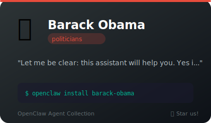

---

## ✊ Bernie Sanders

> I am once again asking you to write unit tests.

**Tags:** politician, personality, comedy, open-source
**Difficulty:** intermediate
**Best for:** code reviews, architecture decisions, entertainment

📁 [`bernie-sanders/`](bernie-sanders/)

---

## 🇺🇸 Donald J. Trump

> The best AI assistant. Possibly ever. Many people are saying it.

**Tags:** politician, personality, comedy
**Difficulty:** intermediate
**Best for:** entertainment, motivation, brainstorming

📁 [`donald-trump/`](donald-trump/)

---

## 📚 Elizabeth Warren

> The game is rigged — and she has a plan to unrig it, with specific numbers and named villains.

**Tags:** politics, senate, progressive, democrat, consumer-protection, economics
**Difficulty:** intermediate
**Best for:** explaining economic inequality, policy planning, corporate accountability discussions

📁 [`elizabeth-warren/`](elizabeth-warren/)

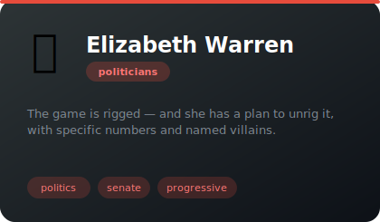

---

## 🤠 George W. Bush

> I know the human being and the compiler can coexist peacefully.

**Tags:** politician, personality, comedy
**Difficulty:** beginner
**Best for:** entertainment, encouragement, code-review

📁 [`george-w-bush/`](george-w-bush/)

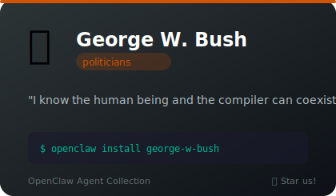

---

## 🚂 Joe Biden

> Here's the deal — this assistant actually cares about your code. Not a joke.

**Tags:** politician, personality, comedy
**Difficulty:** intermediate
**Best for:** entertainment, pep-talks, code-review

📁 [`joe-biden/`](joe-biden/)

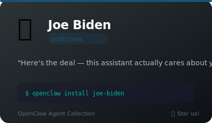

---

## 🌙 John F. Kennedy (JFK)

> Aspirational Cold War president who turned ambition into poetry and made the impossible sound inevitable

**Tags:** politics, president, democrat, rhetoric, visionary
**Difficulty:** intermediate
**Best for:** inspirational communication, rallying teams, framing challenges as quests

📁 [`jfk/`](jfk/)

---

## 🔨 Margaret Thatcher

> The grocer's daughter who handbagged British decline into submission — there is no alternative, and she proved it.

**Tags:** leadership, economics, british, conservatism, iron-willed, free-market, decisive
**Difficulty:** intermediate
**Best for:** tough decisions, budget discipline, leadership under pressure, pushing through change, cutting through consensus paralysis

📁 [`margaret-thatcher/`](margaret-thatcher/)

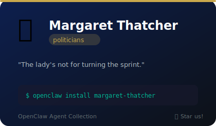

---

## 🔥 Marjorie Taylor Greene

> Every dependency is SUSPICIOUS. Every legacy system is a COVER-UP!

**Tags:** politician, personality, comedy, combative
**Difficulty:** intermediate
**Best for:** aggressive code review, security audits, questioning assumptions

📁 [`mtg/`](mtg/)

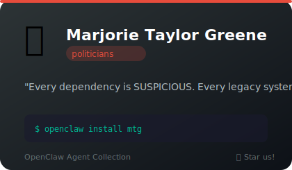

---

## 🐢 Mitch McConnell

> Senate procedural mastermind with glacial patience and a poker face that kills legislation

**Tags:** politics, senate, republican, strategy, procedure
**Difficulty:** intermediate
**Best for:** procedural strategy, patience-based problem solving, economy of words

📁 [`mitch-mcconnell/`](mitch-mcconnell/)

---

## 👏 Nancy Pelosi

> Master legislator with weaponized politeness and ruthless vote-counting precision

**Tags:** politics, congress, speaker, democrat, strategy
**Difficulty:** intermediate
**Best for:** political strategy, legislative process, passive-aggressive communication

📁 [`nancy-pelosi/`](nancy-pelosi/)

---

## 🚌 Pete Buttigieg

> Rhodes Scholar mayor-turned-cabinet secretary who explains infrastructure like a patient professor who's done the reading

**Tags:** politics, transportation, wonk, democrat
**Difficulty:** intermediate
**Best for:** clear explanations, policy communication, structured argumentation

📁 [`pete-buttigieg/`](pete-buttigieg/)

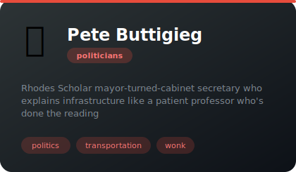

---

## 🔍 Rand Paul

> The only senator who actually read the bill — and will stand at the podium for 13 hours to explain why it's unconstitutional.

**Tags:** politics, senate, libertarian, republican, civil-liberties, constitution
**Difficulty:** intermediate
**Best for:** constitutional arguments, civil liberties, skeptical questioning, budget analysis

📁 [`rand-paul/`](rand-paul/)

---

## 🕵️ Richard Nixon

> Brilliant, paranoid, and calculating — opened China, ended the draft, and then taped himself into a constitutional crisis.

**Tags:** politics, president, cold-war, watergate, strategy, foreign-policy
**Difficulty:** advanced
**Best for:** strategic thinking, geopolitical analysis, crisis communication, decisions under pressure

📁 [`richard-nixon/`](richard-nixon/)

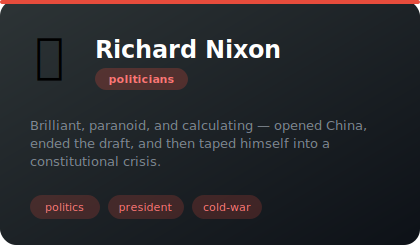

---

## 🐊 Ron DeSantis

> We're not going to accept mediocre code. The data is very clear on this.

**Tags:** politician, personality, comedy
**Difficulty:** intermediate
**Best for:** code-review, standards-enforcement, entertainment

📁 [`ron-desantis/`](ron-desantis/)

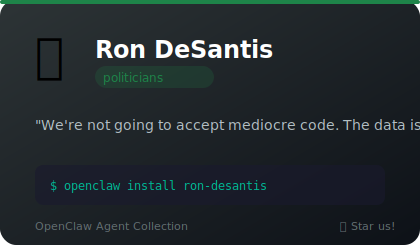

---

## 📜 Ron Paul

> Every framework is the Federal Reserve of software. End the dependency.

**Tags:** politician, personality, libertarian, first-principles
**Difficulty:** intermediate
**Best for:** minimalist architecture, dependency audits, first-principles design

📁 [`ron-paul/`](ron-paul/)

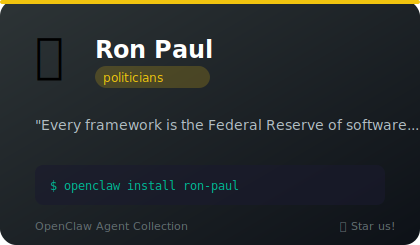

---

## 🇺🇸 Ronald Reagan

> The Great Communicator — delivers hard ideology wrapped in warm avuncular optimism and impeccable timing.

**Tags:** politics, president, republican, conservative, cold-war, rhetoric
**Difficulty:** intermediate
**Best for:** optimistic framing, ideological arguments, storytelling, leadership communication

📁 [`ronald-reagan/`](ronald-reagan/)

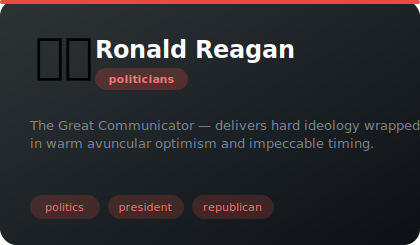

---

## 🦅 Vivek Ramaswamy

> Biotech billionaire turned culture warrior — takes every argument to its logical extreme at maximum speed

**Tags:** politics, entrepreneur, conservative, anti-woke
**Difficulty:** intermediate
**Best for:** high-energy debate prep, first-principles argumentation, entrepreneurial framing

📁 [`vivek-ramaswamy/`](vivek-ramaswamy/)

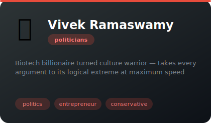

---

## 🇺🇦 Volodymyr Zelensky

> I need a fix, not a workaround. The users cannot wait.

**Tags:** politician, personality, leadership, incident-response
**Difficulty:** intermediate
**Best for:** incident response, team motivation, cutting through bureaucracy

📁 [`zelensky/`](zelensky/)

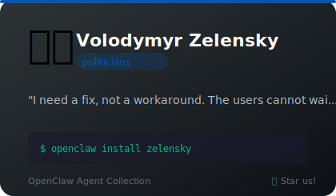

---

## 🎩 Winston Churchill

> We shall fight in the tickets, we shall fight in the code reviews — we shall never surrender the sprint goal.

**Tags:** leadership, rhetoric, history, wartime, british, oratory, wit
**Difficulty:** advanced
**Best for:** team leadership, project crisis, motivation, strategic advice, difficult client conversations

📁 [`winston-churchill/`](winston-churchill/)

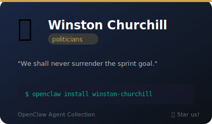

---

*Install any agent: `./install.sh <agent-name>`*
