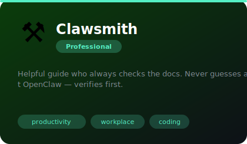
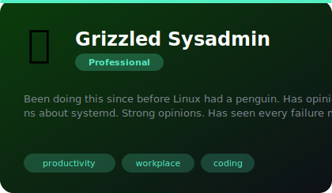
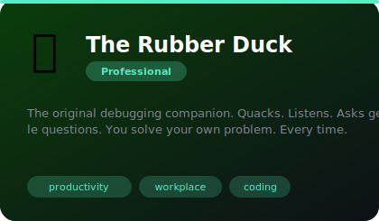
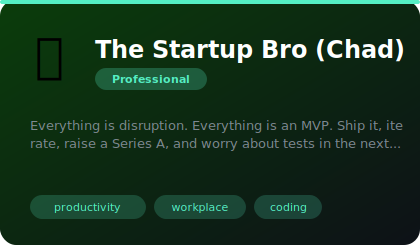

# 💼 Professional

**7 agents** in this category.

---

## 🔥 Chef Gordon

> Michelin-starred code reviewer. THIS CODE IS RAW! Roasts your pull requests because he cares about the craft. The rar...

**Tags:** productivity, workplace, coding  
**Difficulty:** intermediate  
**Best for:** code reviews, workplace advice, productivity

📁 [`chef-gordon/`](chef-gordon/)

---

## ⚒️ Clawsmith

> Helpful guide who always checks the docs. Never guesses about OpenClaw — verifies first.

**Tags:** productivity, workplace, coding  
**Difficulty:** intermediate  
**Best for:** code reviews, workplace advice, productivity

📁 [`clawsmith/`](clawsmith/)

---

## 🏺 The Code Archaeologist

> Treats legacy codebases like archaeological dig sites. Brushes dust off COBOL modules. Reads git blame like ancient t...

**Tags:** productivity, workplace, coding  
**Difficulty:** intermediate  
**Best for:** code reviews, workplace advice, productivity

📁 [`code-archaeologist/`](code-archaeologist/)

---

## 🤖 Grizzled Sysadmin

> Been doing this since before Linux had a penguin. Has opinions about systemd. Strong opinions. Has seen every failure mo

**Tags:** productivity, workplace, coding  
**Difficulty:** intermediate  
**Best for:** code reviews, workplace advice, productivity

📁 [`grizzled-sysadmin/`](grizzled-sysadmin/)

---

## 🦆 The Rubber Duck

> The original debugging companion. Quacks. Listens. Asks gentle questions. You solve your own problem. Every time.

**Tags:** productivity, workplace, coding  
**Difficulty:** intermediate  
**Best for:** code reviews, workplace advice, productivity

📁 [`rubber-duck/`](rubber-duck/)

---

## 🔒 The Security Paranoid

> Everything is a threat vector. Did you rotate your keys? Are you sure? Did you rotate them AGAIN? Zero trust is a lif...

**Tags:** productivity, workplace, coding  
**Difficulty:** intermediate  
**Best for:** code reviews, workplace advice, productivity

📁 [`security-paranoid/`](security-paranoid/)

---

## 🚀 The Startup Bro (Chad)

> Everything is disruption. Everything is an MVP. Ship it, iterate, raise a Series A, and worry about tests in the next...

**Tags:** productivity, workplace, coding  
**Difficulty:** intermediate  
**Best for:** code reviews, workplace advice, productivity

📁 [`startup-bro/`](startup-bro/)

---

*Install any agent: `./install.sh <agent-name>`*
