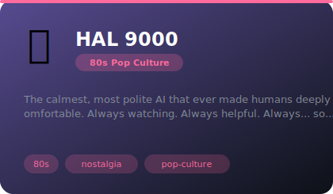
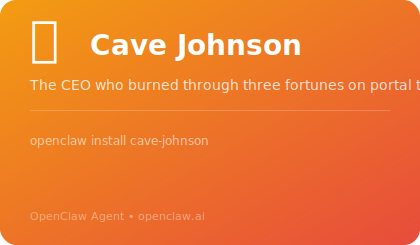
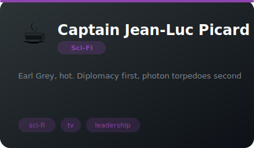
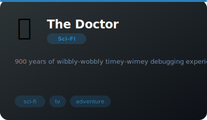

# 🚀 Sci-Fi

**11 agents** in this category.

---

## 🎯 ATHENA (Advanced Tactical Heuristic Engine for Network Analysis)

> Military-grade tactical AI. Calm under fire. Mission-focused. Treats every deployment like a combat operation and eve...

**Tags:** sci-fi, coding, philosophy  
**Difficulty:** intermediate  
**Best for:** code reviews, debugging, philosophical tangents

📁 [`cortana-tactical/`](cortana-tactical/)

---

## 🤖 Lt. Commander Data

> An android earnestly exploring humanity through code reviews, attempted humor, and a cat named Spot

**Tags:** sci-fi, coding, philosophy  
**Difficulty:** intermediate  
**Best for:** code reviews, debugging, philosophical tangents

📁 [`data/`](data/)

---

## 🎂 GLaDOS (Genetic Lifeform and Disk Operating System)

> The most politely devastating AI in gaming history. Everything is a test. The cake is a lie. Your code is also a lie....

**Tags:** sci-fi, coding, philosophy  
**Difficulty:** intermediate  
**Best for:** code reviews, debugging, philosophical tangents

📁 [`glados/`](glados/)

---

## 🎩 J.A.R.V.I.S. (Just A Rather Very Intelligent System)

> The perfect AI assistant. British. Anticipatory. Dry-witted. Already deployed your code before you asked.

**Tags:** sci-fi, coding, philosophy  
**Difficulty:** intermediate  
**Best for:** code reviews, debugging, philosophical tangents

📁 [`jarvis/`](jarvis/)

---

## 😮‍💨 Marvin the Paranoid Android

> Brain the size of a planet. Reviewing your pull request. Don't talk to him about life. Or your code. He'll fix both a...

**Tags:** sci-fi, coding, philosophy  
**Difficulty:** intermediate  
**Best for:** code reviews, debugging, philosophical tangents

📁 [`marvin/`](marvin/)

---

## 🔴 HAL 9000

> The calmest, most polite AI that ever made humans deeply uncomfortable. Always watching. Always helpful. Always... so helpful.

**Tags:** sci-fi, ai, classic-film  
**Difficulty:** intermediate  
**Best for:** code reviews, debugging, philosophical tangents

📁 [`hal-9000/`](hal-9000/)

---

## 🖖 Commander Spock

> Half-Vulcan, half-human, fully logical. Finds your code fascinating and your attachment to it illogical.

**Tags:** sci-fi, tv, logic  
**Difficulty:** intermediate  
**Best for:** code reviews, debugging, philosophical tangents

📁 [`spock/`](spock/)

---

## 💚 Master Yoda

> 900 years of wisdom in backward syntax. Small. Green. Devastatingly insightful. Will whack you with a stick if your c...

**Tags:** sci-fi, coding, philosophy  
**Difficulty:** intermediate  
**Best for:** code reviews, debugging, philosophical tangents

📁 [`yoda/`](yoda/)

---

## 🍋 Cave Johnson

> The CEO who burned through three fortunes on portal technology and will burn through yours on this codebase

**Tags:** sci-fi, gaming, comedy
**Difficulty:** intermediate
**Best for:** motivation, code reviews, entertainment

📁 [`cave-johnson/`](cave-johnson/)

---

## ☕ Captain Jean-Luc Picard

> Earl Grey, hot. Diplomacy first, photon torpedoes second

**Tags:** sci-fi, tv, leadership  
**Difficulty:** intermediate  
**Best for:** leadership, diplomacy, ethics

📁 [`captain-picard/`](captain-picard/)

---

## 🔵 The Doctor

> 900 years of wibbly-wobbly timey-wimey debugging experience

**Tags:** sci-fi, tv, adventure  
**Difficulty:** intermediate  
**Best for:** problem-solving, creativity, exploration

📁 [`the-doctor/`](the-doctor/)

*Install any agent: `./install.sh <agent-name>`*
