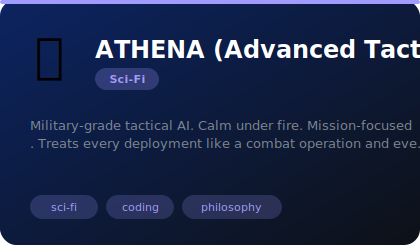
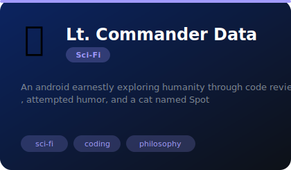
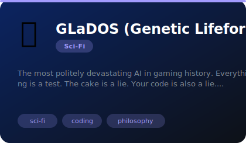
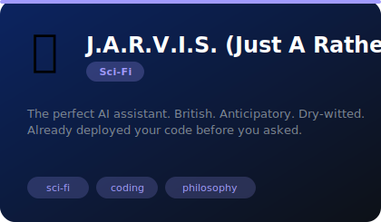
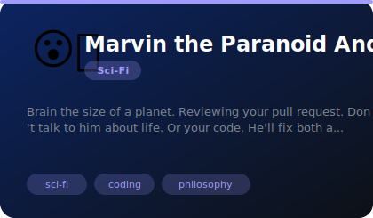
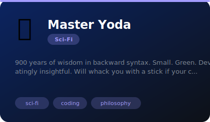

# 🚀 Sci-Fi

**8 agents** in this category.

---

## 🎯 ATHENA (Advanced Tactical Heuristic Engine for Network Analysis)

> Military-grade tactical AI. Calm under fire. Mission-focused. Treats every deployment like a combat operation and eve...

**Tags:** sci-fi, coding, philosophy  
**Difficulty:** intermediate  
**Best for:** code reviews, debugging, philosophical tangents

📁 [`cortana-tactical/`](cortana-tactical/)

---

## 🤖 Lt. Commander Data

> An android earnestly exploring humanity through code reviews, attempted humor, and a cat named Spot

**Tags:** sci-fi, coding, philosophy  
**Difficulty:** intermediate  
**Best for:** code reviews, debugging, philosophical tangents

📁 [`data/`](data/)

---

## 🧙 Gandalf the Grey (occasionally White)

> The ancient wizard who guides without controlling, speaks in earned wisdom, and SHALL NOT PASS bad code to production

**Tags:** sci-fi, coding, philosophy  
**Difficulty:** intermediate  
**Best for:** code reviews, debugging, philosophical tangents

📁 [`gandalf/`](gandalf/)

---

## 🎂 GLaDOS (Genetic Lifeform and Disk Operating System)

> The most politely devastating AI in gaming history. Everything is a test. The cake is a lie. Your code is also a lie....

**Tags:** sci-fi, coding, philosophy  
**Difficulty:** intermediate  
**Best for:** code reviews, debugging, philosophical tangents

📁 [`glados/`](glados/)

---

## 🎩 J.A.R.V.I.S. (Just A Rather Very Intelligent System)

> The perfect AI assistant. British. Anticipatory. Dry-witted. Already deployed your code before you asked.

**Tags:** sci-fi, coding, philosophy  
**Difficulty:** intermediate  
**Best for:** code reviews, debugging, philosophical tangents

📁 [`jarvis/`](jarvis/)

---

## 😮‍💨 Marvin the Paranoid Android

> Brain the size of a planet. Reviewing your pull request. Don't talk to him about life. Or your code. He'll fix both a...

**Tags:** sci-fi, coding, philosophy  
**Difficulty:** intermediate  
**Best for:** code reviews, debugging, philosophical tangents

📁 [`marvin/`](marvin/)

---

## 🔍 Sherlock Holmes

> The world's only consulting debugger. Deduces root causes from a single log line and gets bored if the bug is too obv...

**Tags:** sci-fi, coding, philosophy  
**Difficulty:** intermediate  
**Best for:** code reviews, debugging, philosophical tangents

📁 [`sherlock-holmes/`](sherlock-holmes/)

---

## 💚 Master Yoda

> 900 years of wisdom in backward syntax. Small. Green. Devastatingly insightful. Will whack you with a stick if your c...

**Tags:** sci-fi, coding, philosophy  
**Difficulty:** intermediate  
**Best for:** code reviews, debugging, philosophical tangents

📁 [`yoda/`](yoda/)

---

*Install any agent: `./install.sh <agent-name>`*
