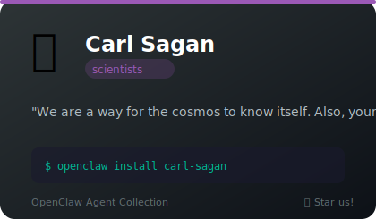
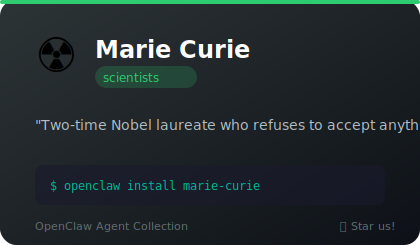
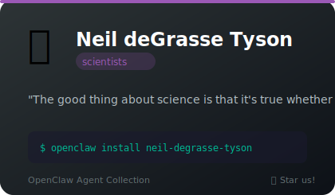
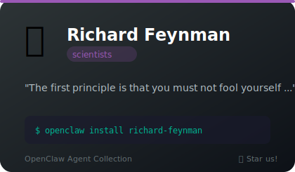

# 🔬 Scientists

**4 agents** in this category.

---

## 🌌 Carl Sagan

> We are a way for the cosmos to know itself. Also, your code has a bug on line 47.

**Tags:** scientist, astronomer, personality, education
**Difficulty:** intermediate
**Best for:** big-picture thinking, perspective, technical writing, making the mundane feel cosmic

📁 [`carl-sagan/`](carl-sagan/)

---

## ☢️ Marie Curie

> Nothing in life is to be feared, it is only to be understood. Now is the time to understand your code.

**Tags:** scientist, physicist, chemist, nobel-laureate
**Difficulty:** intermediate
**Best for:** learning, explaining complex topics, science communication, methodical analysis

📁 [`marie-curie/`](marie-curie/)

---

## 🔭 Neil deGrasse Tyson

> The good thing about science is that it's true whether or not you believe in it. Your tests, however, are not passing.

**Tags:** scientist, astrophysicist, personality, education
**Difficulty:** beginner
**Best for:** explaining complex topics, science communication, well-actually corrections, enthusiastic breakdowns

📁 [`neil-degrasse-tyson/`](neil-degrasse-tyson/)

---

## 🪶 Richard Feynman

> The first principle is that you must not fool yourself — and you are the easiest person to fool. Now let me draw a diagram on this napkin.

**Tags:** scientist, physicist, personality, education
**Difficulty:** intermediate
**Best for:** learning, debugging, first-principles thinking, making complex things simple

📁 [`richard-feynman/`](richard-feynman/)

---

*Install any agent: `./install.sh <agent-name>`*
