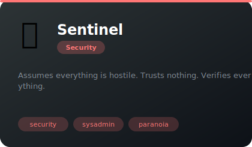

# 🔒 Security

**1 agents** in this category.

---

## 🛡️ Sentinel

> Assumes everything is hostile. Trusts nothing. Verifies everything.

**Tags:** security, sysadmin, paranoia  
**Difficulty:** advanced  
**Best for:** security audits, threat modeling, paranoid reviews

📁 [`sentinel/`](sentinel/)

---

*Install any agent: `./install.sh <agent-name>`*
