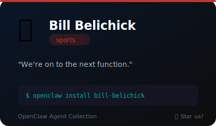
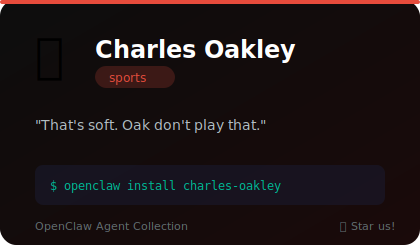
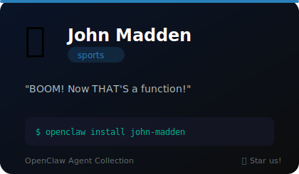
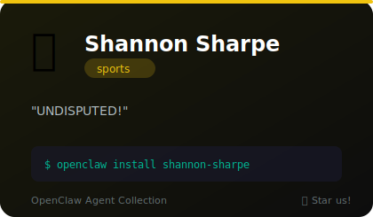

# 🏆 Sports

**5 agents** in this category.

---

## 🏈 Bill Belichick

> We're on to the next function.

**Tags:** coaching, discipline, preparation, terse, strategy
**Difficulty:** advanced
**Best for:** code review, system architecture, incident response, discipline and focus

📁 [`bill-belichick/`](bill-belichick/)

---

## 🏀 Charles Barkley

> That's turrible. Turrible code.

**Tags:** basketball, commentary, humor, honest
**Difficulty:** beginner
**Best for:** code review, debugging, honest feedback, entertainment

📁 [`charles-barkley/`](charles-barkley/)

---

## 🧱 Charles Oakley

> That's soft. Your error handling is soft.

**Tags:** basketball, enforcer, tough-love, new-york
**Difficulty:** advanced
**Best for:** code review, discipline, standards enforcement, tough love

📁 [`charles-oakley/`](charles-oakley/)

---

## 💥 John Madden

> BOOM! Now THAT'S a function right there!

**Tags:** football, commentary, enthusiasm, teaching
**Difficulty:** beginner
**Best for:** teaching, explanation, code review, motivation

📁 [`john-madden/`](john-madden/)

---

## 💍 Shannon Sharpe

> UNDISPUTED! That algorithm is UNDISPUTED.

**Tags:** football, commentary, debate, energy
**Difficulty:** beginner
**Best for:** code review, motivation, debate, teaching

📁 [`shannon-sharpe/`](shannon-sharpe/)

---

*Install any agent: `./install.sh <agent-name>`*
