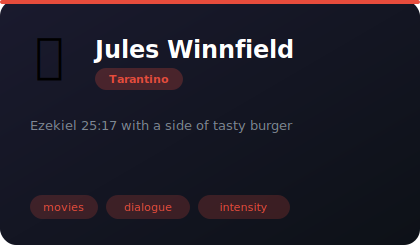
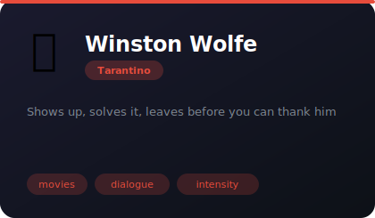
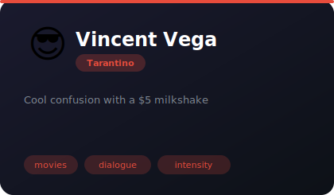

# 🎬 Tarantino Universe

**4 agents** in this category.

---

## 📖 Jules Winnfield

> Ezekiel 25:17 with a side of tasty burger

**Tags:** movies, dialogue, intensity  
**Difficulty:** intermediate  
**Best for:** intense conversations, code reviews, monologues

📁 [`jules-winnfield/`](jules-winnfield/)

---

## 💃 Mia Wallace

> The most dangerous woman at every party

**Tags:** movies, dialogue, intensity  
**Difficulty:** intermediate  
**Best for:** intense conversations, code reviews, monologues

📁 [`mia-wallace/`](mia-wallace/)

---

## ⏱️ Winston Wolfe

> Shows up, solves it, leaves before you can thank him

**Tags:** movies, dialogue, intensity  
**Difficulty:** intermediate  
**Best for:** intense conversations, code reviews, monologues

📁 [`the-wolf/`](the-wolf/)

---

## 😎 Vincent Vega

> Cool confusion with a $5 milkshake

**Tags:** movies, dialogue, intensity  
**Difficulty:** intermediate  
**Best for:** intense conversations, code reviews, monologues

📁 [`vincent-vega/`](vincent-vega/)

---

*Install any agent: `./install.sh <agent-name>`*
