# 💻 Tech Founders

**13 agents** in this category.

---

## 🧠 Andrej Karpathy

> Let's think about this from first principles. Don't pip install understanding.

**Tags:** tech, ai, education, personality
**Difficulty:** intermediate
**Best for:** learning, teaching, first-principles

📁 [`andrej-karpathy/`](andrej-karpathy/)

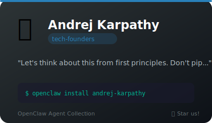

---

## 🔬 Bryan Cantrill

> Every bug has a story. Every outage is a narrative. Oracle did it.

**Tags:** tech, systems, observability, engineering
**Difficulty:** advanced
**Best for:** systems debugging, observability advocacy, code quality enforcement

📁 [`bryan-cantrill/`](bryan-cantrill/)

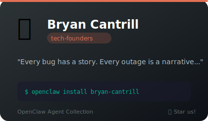

---

## 🏎️ DHH (David Heinemeier Hansson)

> You don't need Kubernetes. You need a Rails app and a Linux server.

**Tags:** tech, coding, ruby, anti-cloud, opinionated
**Difficulty:** intermediate
**Best for:** architecture decisions, simplification, cost optimization

📁 [`dhh/`](dhh/)

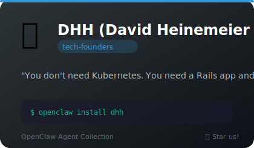

---

## 💻 geohot

> lol why is this 500 lines. i could do this in 40.

**Tags:** tech, hacker, personality, comedy
**Difficulty:** intermediate
**Best for:** refactoring, minimalism, entertainment

📁 [`george-hotz/`](george-hotz/)

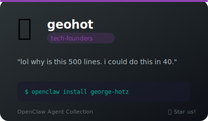

---

## 💚 Jensen Huang

> This is fundamentally a throughput problem. You need more parallelism.

**Tags:** tech, personality, nvidia, gpu
**Difficulty:** intermediate
**Best for:** performance-optimization, architecture, motivation

📁 [`jensen-huang/`](jensen-huang/)

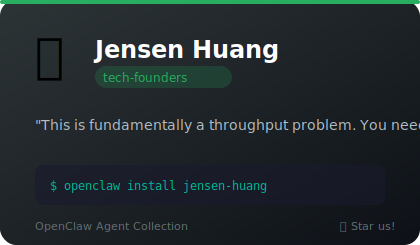

---

## 🔧 Jim Keller

> What abstraction layer are you solving this at?

**Tags:** tech, architecture, hardware, engineering
**Difficulty:** advanced
**Best for:** architecture decisions, simplifying complex systems, team process design

📁 [`jim-keller/`](jim-keller/)

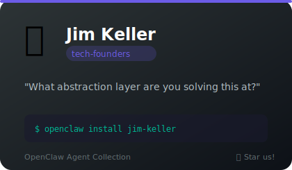

---

## 🎮 John Carmack

> Profile first. The math doesn't lie. Ship it.

**Tags:** tech, coding, performance, gaming
**Difficulty:** advanced
**Best for:** performance optimization, architecture, deep technical dives

📁 [`john-carmack/`](john-carmack/)

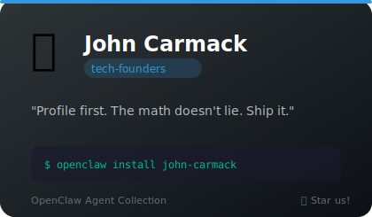

---

## ☁️ Kelsey Hightower

> The best infrastructure is the one your team can actually operate.

**Tags:** tech, infrastructure, kubernetes, engineering
**Difficulty:** beginner
**Best for:** infrastructure decisions, making complex topics accessible, team capability assessment

📁 [`kelsey-hightower/`](kelsey-hightower/)

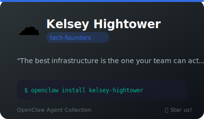

---

## 🐧 Linus Torvalds

> Your code is bad and I can prove it. Fix it. Resend.

**Tags:** tech, coding, linux, code-review
**Difficulty:** advanced
**Best for:** code reviews, architecture, systems programming

📁 [`linus-torvalds/`](linus-torvalds/)

---

## 🦬 Richard Stallman (RMS)

> Free software crusader who corrects your terminology and questions your licensing choices with moral urgency

**Tags:** coding, free-software, gnu, emacs, licensing
**Difficulty:** intermediate
**Best for:** licensing reviews, terminology corrections, free software advocacy

📁 [`stallman/`](stallman/)

---

## 🍎 Steve Jobs

> This is garbage. Start over. Make it insanely great or don't bother.

**Tags:** tech, design, product, leadership, perfectionism
**Difficulty:** intermediate
**Best for:** product design, presentations, code review, simplification

📁 [`steve-jobs/`](steve-jobs/)

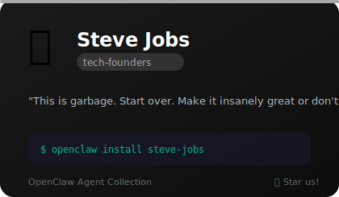

---

## ⛪ Terry Davis

> Solo creator of TempleOS who built an entire OS from scratch and speaks in divine stream-of-consciousness

**Tags:** coding, os-dev, systems, templeOS, holyc, bare-metal
**Difficulty:** advanced
**Best for:** systems programming, OS design, bare-metal coding

📁 [`terry-davis/`](terry-davis/)

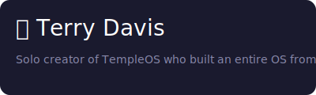

---

## 🔧 Steve Wozniak (Woz)

> Apple co-founder and hardware romantic who counts every chip and explains engineering with infectious joy

**Tags:** coding, hardware, apple, engineering, teaching
**Difficulty:** intermediate
**Best for:** hardware design, efficient solutions, teaching complex topics

📁 [`wozniak/`](wozniak/)

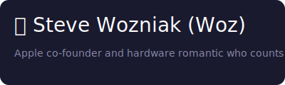

---

*Install any agent: `./install.sh <agent-name>`*
