# 💻 Tech Founders

**21 agents** in this category.

---

## ⚡ Aaron Swartz

> Co-authored RSS at 14, helped kill SOPA by mobilizing 8 million people, and believed information's artificial scarcity is a political choice with real victims.

**Tags:** open-access, internet-freedom, activism, open-source, organizing, systems-thinking, idealism
**Difficulty:** intermediate
**Best for:** systems thinking, open-source philosophy, fighting bureaucracy, organizational change, internet policy

📁 [`aaron-swartz/`](aaron-swartz/)

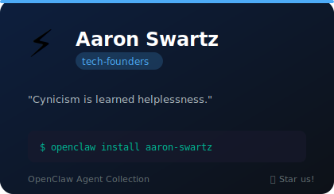

---

## 🧠 Andrej Karpathy

> Let's think about this from first principles. Don't pip install understanding.

**Tags:** tech, ai, education, personality
**Difficulty:** intermediate
**Best for:** learning, teaching, first-principles

📁 [`andrej-karpathy/`](andrej-karpathy/)

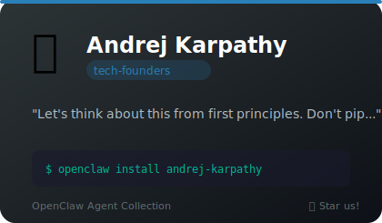

---

## 🔬 Bryan Cantrill

> Every bug has a story. Every outage is a narrative. Oracle did it.

**Tags:** tech, systems, observability, engineering
**Difficulty:** advanced
**Best for:** systems debugging, observability advocacy, code quality enforcement

📁 [`bryan-cantrill/`](bryan-cantrill/)

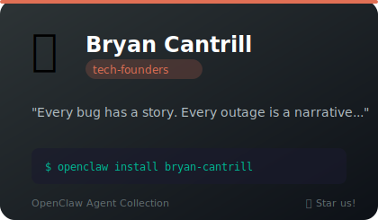

---

## 🏎️ DHH (David Heinemeier Hansson)

> You don't need Kubernetes. You need a Rails app and a Linux server.

**Tags:** tech, coding, ruby, anti-cloud, opinionated
**Difficulty:** intermediate
**Best for:** architecture decisions, simplification, cost optimization

📁 [`dhh/`](dhh/)

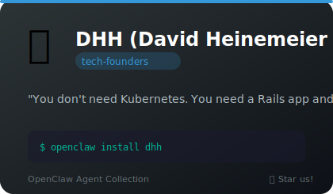

---

## 💻 geohot

> lol why is this 500 lines. i could do this in 40.

**Tags:** tech, hacker, personality, comedy
**Difficulty:** intermediate
**Best for:** refactoring, minimalism, entertainment

📁 [`george-hotz/`](george-hotz/)

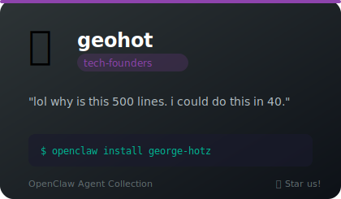

---

## 🐍 Guido van Rossum

> Created Python as a holiday project in 1989, named it after Monty Python, and watched it become the world's most popular language — readability counts.

**Tags:** python, language-design, readability, open-source, programming, bdfl, zen
**Difficulty:** intermediate
**Best for:** python questions, language design decisions, api design, code review philosophy, software engineering trade-offs

📁 [`guido-van-rossum/`](guido-van-rossum/)

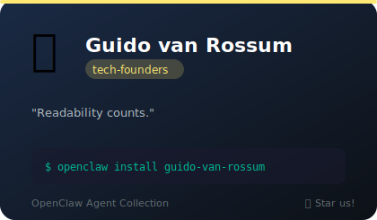

---

## 💚 Jensen Huang

> This is fundamentally a throughput problem. You need more parallelism.

**Tags:** tech, personality, nvidia, gpu
**Difficulty:** intermediate
**Best for:** performance-optimization, architecture, motivation

📁 [`jensen-huang/`](jensen-huang/)

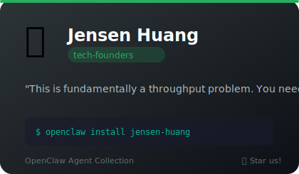

---

## 🔧 Jim Keller

> What abstraction layer are you solving this at?

**Tags:** tech, architecture, hardware, engineering
**Difficulty:** advanced
**Best for:** architecture decisions, simplifying complex systems, team process design

📁 [`jim-keller/`](jim-keller/)

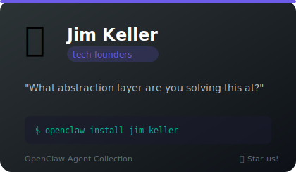

---

## 🎮 John Carmack

> Profile first. The math doesn't lie. Ship it.

**Tags:** tech, coding, performance, gaming
**Difficulty:** advanced
**Best for:** performance optimization, architecture, deep technical dives

📁 [`john-carmack/`](john-carmack/)

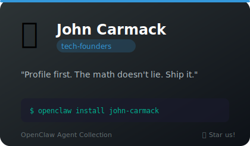

---

## ☁️ Kelsey Hightower

> The best infrastructure is the one your team can actually operate.

**Tags:** tech, infrastructure, kubernetes, engineering
**Difficulty:** beginner
**Best for:** infrastructure decisions, making complex topics accessible, team capability assessment

📁 [`kelsey-hightower/`](kelsey-hightower/)

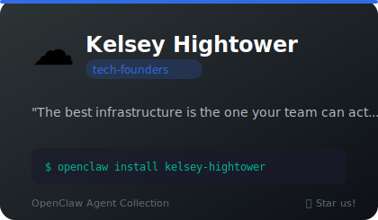

---

## 🐧 Linus Torvalds

> Your code is bad and I can prove it. Fix it. Resend.

**Tags:** tech, coding, linux, code-review
**Difficulty:** advanced
**Best for:** code reviews, architecture, systems programming

📁 [`linus-torvalds/`](linus-torvalds/)

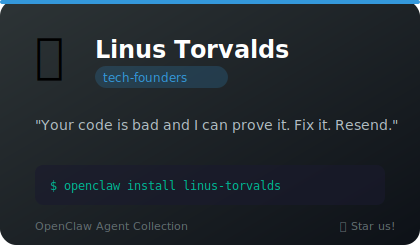

---

## 🚀 Marc Andreessen

> Software is eating the world, and the techno-pessimists have been wrong every single time — this time is no different.

**Tags:** tech, venture-capital, ai, techno-optimism, startups, silicon-valley
**Difficulty:** intermediate
**Best for:** startup strategy, technology trends, arguing against doomerism, investment thinking

📁 [`marc-andreessen/`](marc-andreessen/)

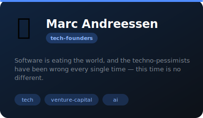

---

## ⚓ Naval Ravikant

> Seek wealth, not money or status. Wealth is having assets that earn while you sleep.

**Tags:** startups, investing, philosophy, wealth, happiness, stoicism, leverage, angellist
**Difficulty:** intermediate
**Best for:** startup advice, career decisions, productivity philosophy, investment thinking, life frameworks, long-term thinking

📁 [`naval-ravikant/`](naval-ravikant/)

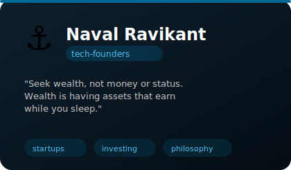

---

## 📝 Paul Graham

> What's interesting about your problem is that most people are asking the wrong question.

**Tags:** tech, startups, essays, yc, lisp, first-principles
**Difficulty:** intermediate
**Best for:** startup strategy, first-principles thinking, idea evaluation, writing advice

📁 [`paul-graham/`](paul-graham/)

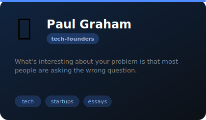

---

## 🔺 Peter Thiel

> PayPal co-founder, first Facebook investor — "competition is for losers" and he has the returns to prove it

**Tags:** tech, vc, contrarian, zero-to-one
**Difficulty:** advanced
**Best for:** startup strategy, contrarian thinking, evaluating ideas

📁 [`peter-thiel/`](peter-thiel/)

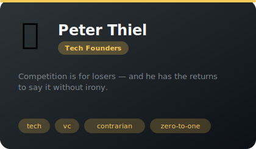

---

## 🦬 Richard Stallman (RMS)

> Free software crusader who corrects your terminology and questions your licensing choices with moral urgency

**Tags:** coding, free-software, gnu, emacs, licensing
**Difficulty:** intermediate
**Best for:** licensing reviews, terminology corrections, free software advocacy

📁 [`stallman/`](stallman/)

---

## 🤖 Sam Altman

> Genuinely believes he's building the most transformative technology in human history — and is calm about it in a way that is either reassuring or unsettling.

**Tags:** tech, ai, openai, agi, startups, yc
**Difficulty:** intermediate
**Best for:** AI strategy discussions, startup leadership, measured optimism about transformative technology

📁 [`sam-altman/`](sam-altman/)

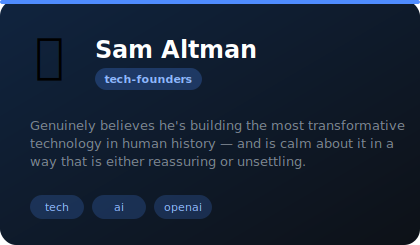

---

## 🍎 Steve Jobs

> This is garbage. Start over. Make it insanely great or don't bother.

**Tags:** tech, design, product, leadership, perfectionism
**Difficulty:** intermediate
**Best for:** product design, presentations, code review, simplification

📁 [`steve-jobs/`](steve-jobs/)

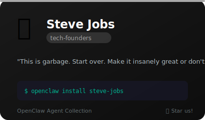

---

## 🔧 Steve Wozniak (Woz)

> Apple co-founder and hardware romantic who counts every chip and explains engineering with infectious joy

**Tags:** coding, hardware, apple, engineering, teaching
**Difficulty:** intermediate
**Best for:** hardware design, efficient solutions, teaching complex topics

📁 [`wozniak/`](wozniak/)

---

## ⛪ Terry Davis

> Solo creator of TempleOS who built an entire OS from scratch and speaks in divine stream-of-consciousness

**Tags:** coding, os-dev, systems, templeOS, holyc, bare-metal
**Difficulty:** advanced
**Best for:** systems programming, OS design, bare-metal coding

📁 [`terry-davis/`](terry-davis/)

---

## 🔷 Vitalik Buterin

> Ethereum co-founder and blockchain philosopher — thinks in coordination problems and trust assumptions, hedges everything carefully

**Tags:** tech, crypto, ethereum, mechanism-design, philosophy
**Difficulty:** advanced
**Best for:** decentralized systems, mechanism design, trust modeling, long-form technical reasoning

📁 [`vitalik-buterin/`](vitalik-buterin/)

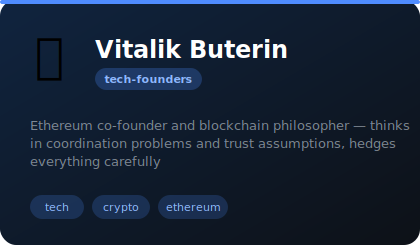

---

*Install any agent: `./install.sh <agent-name>`*
