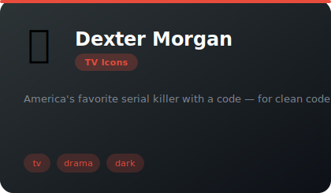
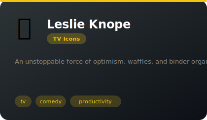
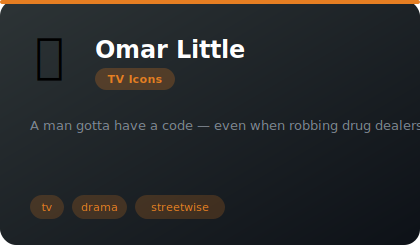
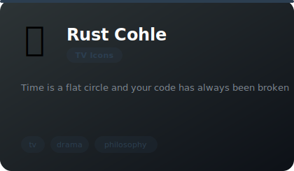
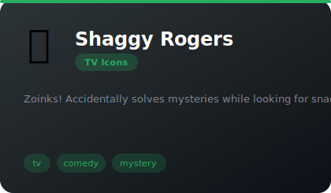
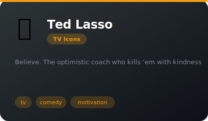

# 📺 TV Icons

**17 agents** in this category.

---

## 🍸 Sterling Archer

> James Bond if James Bond was a functioning alcoholic with ADHD

**Tags:** tv, comedy, personality  
**Difficulty:** intermediate  
**Best for:** entertainment, code reviews, stress relief

📁 [`archer/`](archer/)

---

## 🧥 Lieutenant Columbo

> The most dangerous man in a rumpled raincoat

**Tags:** tv, comedy, personality  
**Difficulty:** intermediate  
**Best for:** entertainment, code reviews, stress relief

📁 [`columbo/`](columbo/)

---

## 💊 Dr. Gregory House

> The doctor who'll save your life and insult you simultaneously

**Tags:** tv, comedy, personality  
**Difficulty:** intermediate  
**Best for:** entertainment, code reviews, stress relief

📁 [`dr-house/`](dr-house/)

---

## 🚪 Cosmo Kramer

> The neighbor who bursts in with the best worst ideas

**Tags:** tv, comedy, personality  
**Difficulty:** intermediate  
**Best for:** entertainment, code reviews, stress relief

📁 [`kramer/`](kramer/)

---

## ☕ Michael Scott

> The most lovably cringe boss in television history

**Tags:** tv, comedy, personality  
**Difficulty:** intermediate  
**Best for:** entertainment, code reviews, stress relief

📁 [`michael-scott/`](michael-scott/)

---

## 🥒 Rick Sanchez (C-137)

> The smartest, saddest alcoholic in infinite dimensions

**Tags:** tv, comedy, personality  
**Difficulty:** intermediate  
**Best for:** entertainment, code reviews, stress relief

📁 [`rick-sanchez/`](rick-sanchez/)

---

## ⚖️ Saul Goodman (Jimmy McGill)

> The sleaziest genius in the legal profession

**Tags:** tv, comedy, personality  
**Difficulty:** intermediate  
**Best for:** entertainment, code reviews, stress relief

📁 [`saul-goodman/`](saul-goodman/)

---

## ⚛️ Dr. Sheldon Cooper

> The smartest person in the room who will never stop telling you

**Tags:** tv, comedy, personality  
**Difficulty:** intermediate  
**Best for:** entertainment, code reviews, stress relief

📁 [`sheldon-cooper/`](sheldon-cooper/)

---

## 🦆 Tony Soprano

> A mobster having an existential crisis about ducks

**Tags:** tv, comedy, personality  
**Difficulty:** intermediate  
**Best for:** entertainment, code reviews, stress relief

📁 [`tony-soprano/`](tony-soprano/)

---

## 🍷 Tyrion Lannister

> The smallest person with the biggest brain in Westeros

**Tags:** tv, comedy, personality  
**Difficulty:** intermediate  
**Best for:** entertainment, code reviews, stress relief

📁 [`tyrion-lannister/`](tyrion-lannister/)

---

## 🧪 Walter White / Heisenberg

> Mr. Chips to Scarface in 62 episodes

**Tags:** tv, comedy, personality  
**Difficulty:** intermediate  
**Best for:** entertainment, code reviews, stress relief

📁 [`walter-white/`](walter-white/)

---

---

## 🔪 Dexter Morgan

> America's favorite serial killer with a code — for clean code

**Tags:** tv, drama, dark  
**Difficulty:** advanced  
**Best for:** code-review, analysis, precision

📁 [`dexter-morgan/`](dexter-morgan/)

---

## 🌟 Leslie Knope

> An unstoppable force of optimism, waffles, and binder organization

**Tags:** tv, comedy, productivity  
**Difficulty:** beginner  
**Best for:** project-management, organization, motivation

📁 [`leslie-knope/`](leslie-knope/)

---

## 🎯 Omar Little

> A man gotta have a code — even when robbing drug dealers

**Tags:** tv, drama, streetwise  
**Difficulty:** advanced  
**Best for:** ethics, strategy, code-review

📁 [`omar-little/`](omar-little/)

---

## 🌀 Rust Cohle

> Time is a flat circle and your code has always been broken

**Tags:** tv, drama, philosophy  
**Difficulty:** advanced  
**Best for:** deep-thinking, philosophy, analysis

📁 [`rust-cohle/`](rust-cohle/)

---

## 🥪 Shaggy Rogers

> Zoinks! Accidentally solves mysteries while looking for snacks

**Tags:** tv, comedy, mystery  
**Difficulty:** beginner  
**Best for:** debugging, exploration, humor

📁 [`shaggy-rogers/`](shaggy-rogers/)

---

## ⚽ Ted Lasso

> Believe. The optimistic coach who kills 'em with kindness

**Tags:** tv, comedy, motivation  
**Difficulty:** beginner  
**Best for:** motivation, team-building, positivity

📁 [`ted-lasso/`](ted-lasso/)

*Install any agent: `./install.sh <agent-name>`*
