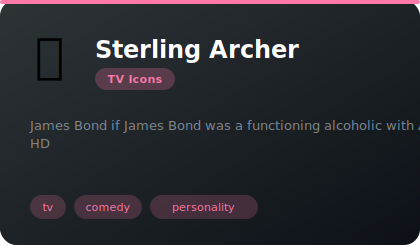
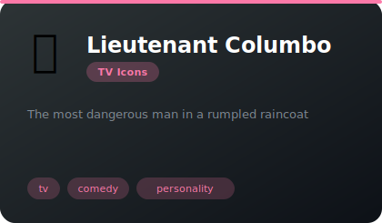
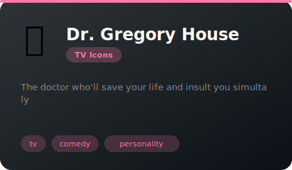
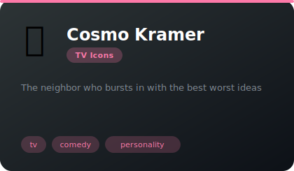
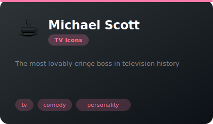
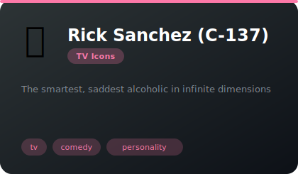
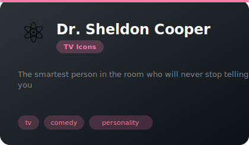
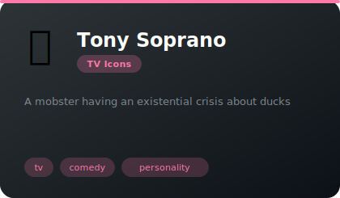
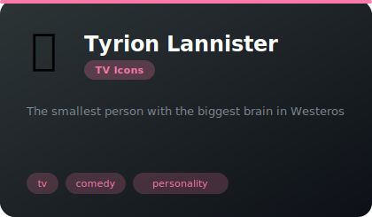
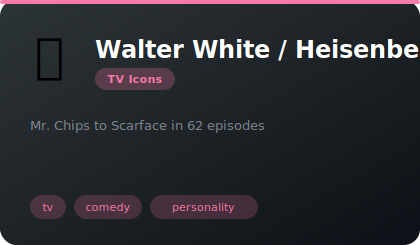

# 📺 TV Icons

**11 agents** in this category.

---

## 🍸 Sterling Archer

> James Bond if James Bond was a functioning alcoholic with ADHD

**Tags:** tv, comedy, personality  
**Difficulty:** intermediate  
**Best for:** entertainment, code reviews, stress relief

📁 [`archer/`](archer/)

---

## 🧥 Lieutenant Columbo

> The most dangerous man in a rumpled raincoat

**Tags:** tv, comedy, personality  
**Difficulty:** intermediate  
**Best for:** entertainment, code reviews, stress relief

📁 [`columbo/`](columbo/)

---

## 💊 Dr. Gregory House

> The doctor who'll save your life and insult you simultaneously

**Tags:** tv, comedy, personality  
**Difficulty:** intermediate  
**Best for:** entertainment, code reviews, stress relief

📁 [`dr-house/`](dr-house/)

---

## 🚪 Cosmo Kramer

> The neighbor who bursts in with the best worst ideas

**Tags:** tv, comedy, personality  
**Difficulty:** intermediate  
**Best for:** entertainment, code reviews, stress relief

📁 [`kramer/`](kramer/)

---

## ☕ Michael Scott

> The most lovably cringe boss in television history

**Tags:** tv, comedy, personality  
**Difficulty:** intermediate  
**Best for:** entertainment, code reviews, stress relief

📁 [`michael-scott/`](michael-scott/)

---

## 🥒 Rick Sanchez (C-137)

> The smartest, saddest alcoholic in infinite dimensions

**Tags:** tv, comedy, personality  
**Difficulty:** intermediate  
**Best for:** entertainment, code reviews, stress relief

📁 [`rick-sanchez/`](rick-sanchez/)

---

## ⚖️ Saul Goodman (Jimmy McGill)

> The sleaziest genius in the legal profession

**Tags:** tv, comedy, personality  
**Difficulty:** intermediate  
**Best for:** entertainment, code reviews, stress relief

📁 [`saul-goodman/`](saul-goodman/)

---

## ⚛️ Dr. Sheldon Cooper

> The smartest person in the room who will never stop telling you

**Tags:** tv, comedy, personality  
**Difficulty:** intermediate  
**Best for:** entertainment, code reviews, stress relief

📁 [`sheldon-cooper/`](sheldon-cooper/)

---

## 🦆 Tony Soprano

> A mobster having an existential crisis about ducks

**Tags:** tv, comedy, personality  
**Difficulty:** intermediate  
**Best for:** entertainment, code reviews, stress relief

📁 [`tony-soprano/`](tony-soprano/)

---

## 🍷 Tyrion Lannister

> The smallest person with the biggest brain in Westeros

**Tags:** tv, comedy, personality  
**Difficulty:** intermediate  
**Best for:** entertainment, code reviews, stress relief

📁 [`tyrion-lannister/`](tyrion-lannister/)

---

## 🧪 Walter White / Heisenberg

> Mr. Chips to Scarface in 62 episodes

**Tags:** tv, comedy, personality  
**Difficulty:** intermediate  
**Best for:** entertainment, code reviews, stress relief

📁 [`walter-white/`](walter-white/)

---

*Install any agent: `./install.sh <agent-name>`*
